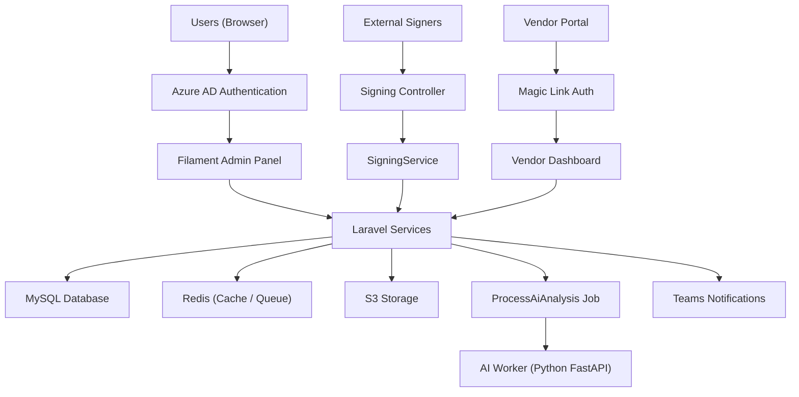
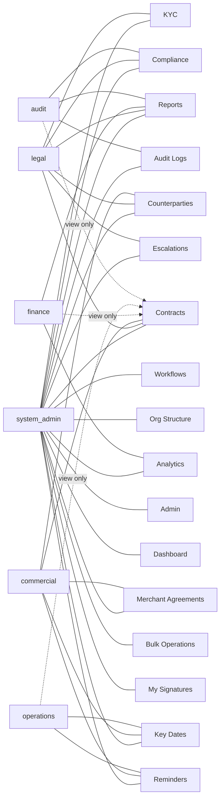

# Platform Overview

## What is CCRS?

CCRS (Contract & Compliance Review System) is Digittal Group's centralised platform for managing the full lifecycle of contracts and merchant agreements. Built on Laravel 12 and Filament 3, CCRS brings together contract drafting, electronic signing, AI-powered analysis, compliance tracking, and vendor self-service into a single web application backed by Azure AD authentication and role-based access control.

---

## Key Capabilities

- **Contract Lifecycle Management** -- Create, review, approve, execute, and archive contracts through configurable workflow stages with full audit trails.
- **Electronic Signing (4 capture methods)** -- Collect legally binding signatures via typed text, drawn signature pad, uploaded image, or webcam capture. External signers receive magic-link invitations with no account required.
- **AI-Powered Analysis (5 types)** -- Automated contract review covering risk assessment, clause extraction, compliance checking, obligation identification, and financial term analysis.
- **Compliance Tracking** -- Map contracts to regulatory frameworks, monitor obligations, and generate compliance reports with escalation workflows.
- **Vendor Portal** -- External counterparties log in via magic links to view their agreements, upload requested documents, and respond to KYC requests.
- **Bulk Operations** -- Upload contracts or structured data in bulk via CSV/Excel, with validation, duplicate detection, and progress tracking.

---

## Platform Architecture

The diagram below shows how CCRS components connect at a high level.

| Component | Technology | Purpose |
|---|---|---|
| Admin Panel | Filament 3 (Livewire) | All internal user interfaces |
| Backend | PHP 8.4 / Laravel 12 | Business logic, APIs, queue jobs |
| Database | MySQL 8.0 | Persistent storage for all entities |
| Cache & Queue | Redis 7 | Session management, job queue, caching |
| File Storage | S3-compatible | Contract PDFs, uploaded documents, signatures |
| AI Worker | Python FastAPI | Contract analysis via Claude SDK |
| Auth | Azure AD (Socialite) | Single sign-on for internal users |

---

## Navigation Overview

CCRS organises its interface into navigation groups. The sections visible to each user depend on their assigned role.

Dashed lines indicate view-only access. Solid lines indicate full read/write access to that navigation group.

### Navigation Groups at a Glance

| Group | Key Pages | Description |
|---|---|---|
| **Contracts** | Contract list, Merchant Agreements | Core contract records and related merchant agreements |
| **Counterparties** | Counterparty list | Organisations and individuals that are parties to contracts |
| **Workflows** | Workflow Templates | Configurable approval and review workflow definitions |
| **KYC** | KYC Templates | Know-Your-Customer document templates and checklists |
| **Org Structure** | Regions, Entities, Projects | Organisational hierarchy used for contract ownership and reporting |
| **Compliance** | Regulatory Frameworks, Audit Logs | Regulatory mapping, obligation tracking, and immutable audit trail |
| **Admin** | Signing Authorities, Jurisdictions, Vendor Users | System configuration and user/vendor management |
| **Dashboard** | Dashboard | Summary widgets showing contract counts, upcoming dates, and alerts |
| **Reports** | Reports, Analytics Dashboard, AI Cost Report | Financial and operational reporting with export to Excel/PDF |
| **Key Dates & Reminders** | Key Dates, Reminders | Expiry tracking, renewal windows, and configurable reminder schedules |
| **Escalations** | Escalations | Overdue and at-risk items requiring management attention |
| **Bulk Operations** | Bulk Contract Upload, Bulk Data Upload | Mass import of contracts and structured reference data |
| **Signing** | My Signatures | Personal queue of documents awaiting the current user's signature |

---

## Roles and Permissions

CCRS uses six predefined roles. Each user is assigned exactly one role, which determines the navigation groups, pages, and actions available to them.

### System Admin

Full access to every area of the platform. System Admins configure the organisational structure (regions, entities, projects), define workflow templates, manage signing authorities and user roles, and perform bulk data uploads. This role is intended for IT administrators and platform owners.

### Legal

Manages the substantive content of contracts. Legal users create and edit contracts, trigger AI-powered analysis, conduct clause-level redlining, manage counterparty records, oversee KYC processes, and monitor compliance against regulatory frameworks. They also handle escalations and generate compliance reports.

### Commercial

Focuses on contract origination and counterparty relationships. Commercial users create new contracts, onboard counterparties, generate merchant agreements from templates, submit override requests for approval thresholds, and track key dates and reminders for their portfolio.

### Finance

Read-only access to contracts with full access to financial reporting. Finance users view contract details without editing, run reports from the analytics dashboard, track AI processing costs, and export financial summaries to Excel and PDF.

### Operations

Day-to-day monitoring of contract timelines. Operations users have read-only access to contract records and focus on key date tracking and reminder management to ensure renewals, expirations, and deliverables are actioned on time.

### Audit

Read-only oversight for governance and compliance. Audit users can view all contract records and their complete audit logs, access compliance reports, and review regulatory framework mappings. They cannot modify any data.

---

## Support

For questions, issues, or feature requests, contact the CCRS support team at **support@digittal.io**.
