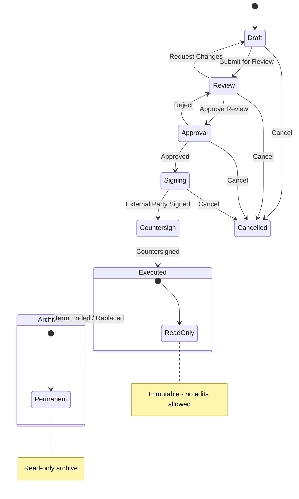
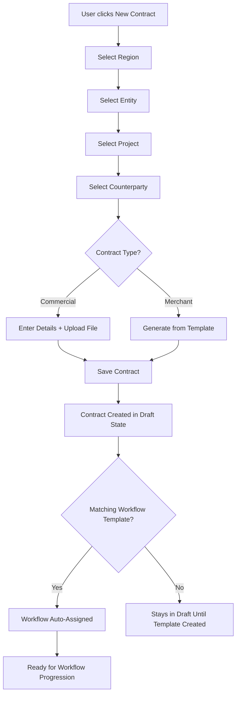

# 3. Contract Lifecycle

## Overview

Every contract in CCRS moves through a defined series of workflow states from creation to completion. The lifecycle ensures proper review, approval, and signing before a contract becomes legally binding. There are seven workflow states:

| State | Description | Key Participants |
|---|---|---|
| **Draft** | The contract has been created but is not yet ready for review. Authors can edit all fields, upload or replace files, and run AI analysis. | Contract Author |
| **Review** | The contract has been submitted for review. Reviewers examine the terms, run AI analysis, and either approve the review or request changes. | Assigned Reviewers |
| **Approval** | The reviewed contract is awaiting formal approval from an authorized approver. The approver can approve it to proceed to signing or reject it back to review. | Approvers (per workflow template) |
| **Signing** | The contract has been approved and is awaiting the external party's signature. A signing invitation is sent to the counterparty. | Contract Author, External Counterparty |
| **Countersign** | The external party has signed. The contract now requires an internal countersignature to finalize the agreement. | Internal Countersigner |
| **Executed** | Both parties have signed. The contract is now legally binding and **immutable** -- no fields can be edited. Amendments, renewals, and side letters can be created from this state. | All stakeholders (read-only) |
| **Archived** | The contract term has ended, or it has been superseded by a renewal or amendment. The contract is permanently read-only. | All stakeholders (read-only) |

A contract can also be **Cancelled** from any active state (Draft, Review, Approval, or Signing).

### Contract Lifecycle State Machine

---

## Creating a Contract

Follow the steps below to create a new contract. The creation flow ensures that every contract is associated with the correct organizational context and counterparty before any content is added.

### Contract Creation Flow

### Step-by-Step

1. **Click "New Contract"** from the Contracts list page.
2. **Select Region** -- Choose the geographic region this contract belongs to. Regions are configured by your administrator.
3. **Select Entity** -- Choose the legal entity entering into the agreement (filtered by the selected region).
4. **Select Project** -- Choose the project this contract is associated with (filtered by the selected entity).
5. **Select Counterparty** -- Choose the external party you are contracting with. If the counterparty does not exist, you can create one from this screen.
6. **Choose Contract Type** -- Select either *Commercial* or *Merchant* (see Contract Types below).
7. **Fill in contract details**:
   - **Title** -- A descriptive name for the contract.
   - **Description** -- A summary of the contract's purpose and key terms.
   - **Start Date** -- The date the contract takes effect.
   - **End Date** -- The date the contract expires.
   - **Value** -- The monetary value of the contract.
   - **Currency** -- The currency for the contract value.
   - **File Upload** -- Upload the contract document (PDF or DOCX) for Commercial contracts, or generate from a template for Merchant contracts.
8. **Save** -- The contract is created in **Draft** state.
9. **Workflow Assignment** -- If a WorkflowTemplate exists that matches the contract type and region/entity/project combination, it is automatically assigned. If no matching template exists, the contract remains in Draft until an administrator creates a matching workflow template.

---

## Contract Types

### Commercial

Commercial contracts are standard agreements uploaded as PDF or DOCX files. These cover a wide range of business arrangements including vendor agreements, service contracts, partnership agreements, and any other commercial arrangement.

- Upload an existing contract document (PDF or DOCX format).
- All contract metadata (title, dates, value, etc.) is entered manually.
- AI analysis can be run on uploaded documents to extract key terms and flag potential issues.

### Merchant

Merchant contracts are generated from a master template (WikiContract) using the Merchant Agreement generator. This ensures consistency across all merchant agreements and reduces manual drafting effort.

- Select a WikiContract template during creation.
- Template fields are pre-populated based on the selected counterparty and organizational context.
- The generated document can be reviewed and adjusted before submission.

---

## File Management

CCRS supports secure document storage and external document management integration.

- **Supported formats**: PDF and DOCX files can be uploaded for any contract.
- **Secure storage**: Uploaded files are stored in S3 with access controlled by CCRS permissions. Only users with appropriate access to the contract can download files.
- **File replacement**: While a contract is in Draft state, the uploaded file can be replaced with an updated version.
- **SharePoint integration**: For organizations using SharePoint for document management, each contract record supports:
  - **SharePoint URL** -- A link to the document in your SharePoint library for quick external access.
  - **SharePoint Version** -- Tracks which version of the SharePoint document corresponds to the CCRS record.

---

## Contract Actions by State

The actions available on a contract depend on its current workflow state. The table below summarizes what you can do at each stage.

### Draft

| Action | Description |
|---|---|
| Edit | Modify any contract field (title, dates, value, description, etc.) |
| Upload new file | Upload or replace the contract document (PDF/DOCX) |
| Delete | Permanently remove the contract |
| Send for Review | Submit the contract to move it into the Review state |
| AI Analysis | Run AI-powered analysis to extract key terms, flag risks, and summarize the document |

### Review

| Action | Description |
|---|---|
| AI Analysis | Run or re-run AI analysis on the contract document |
| Approve | Approve the review and advance the contract to the Approval state |
| Request Changes | Return the contract to Draft with reviewer comments for the author to address |
| Cancel | Cancel the contract entirely |

### Approval

| Action | Description |
|---|---|
| Approve | Formally approve the contract and advance it to the Signing state |
| Reject | Return the contract to the Review state for further examination |
| Cancel | Cancel the contract entirely |

### Signing

| Action | Description |
|---|---|
| Send Signing Invitation | Send a digital signing request to the external counterparty |
| Cancel | Cancel the contract entirely |

### Countersign

| Action | Description |
|---|---|
| Countersign | Apply the internal countersignature to finalize the contract |

### Executed

| Action | Description |
|---|---|
| Download | Download the executed contract document |
| Create Amendment | Create a linked amendment to modify terms of this contract |
| Create Renewal | Create a linked renewal to extend or replace this contract |
| Create Side Letter | Create a linked supplementary agreement |

All other fields are **read-only**. The contract cannot be edited once executed.

### Archived

| Action | Description |
|---|---|
| Download | Download the archived contract document |

Archived contracts are **fully read-only**. No modifications of any kind are permitted.

---

## Access Control

### Restricted Contracts

Contracts can be marked as **restricted** to limit visibility to a specific set of authorized users. This is useful for sensitive agreements such as executive compensation, M&A transactions, or confidential vendor arrangements.

- **Who can restrict**: System Admins and users with the Legal role can mark a contract as restricted or unrestrict it.
- **Effect of restriction**: Once restricted, the contract is hidden from all users except:
  - **System Admins** -- always have access to all contracts.
  - **Authorized users** -- users explicitly added to the contract's access list.
- **Managing access**: The authorized user list is managed through the ContractUserAccess table. Admins and Legal users can add or remove users from this list via the contract detail page.
- **Unrestricting**: Removing the restriction makes the contract visible to all users with standard permissions again.

---

## Linked Contracts

Contracts in CCRS can be linked to other contracts to represent formal relationships between agreements. All linked contracts are managed through the ContractLink model and are created from an **Executed** contract's action menu.

### Amendments

Amendments are formal modifications to an existing executed contract. They are used when specific terms, conditions, or values need to change without replacing the entire agreement.

- Created from the parent contract's action menu.
- Linked to the parent contract with the relationship type `amendment`.
- The amendment follows its own lifecycle (Draft through Executed) independently.
- The parent contract remains unchanged and read-only.

### Renewals

Renewals represent the extension or replacement of an existing contract. When a contract term is ending, a renewal creates a new contract linked to the original.

- Created from the original contract's action menu.
- Linked to the original contract with the relationship type `renewal`.
- Once the renewal is executed, the original contract can be archived (Term Ended / Replaced).
- The renewal carries forward context from the original contract.

### Side Letters

Side letters are supplementary agreements that accompany and modify aspects of a parent contract without formally amending it. They are commonly used for clarifications, temporary modifications, or party-specific arrangements.

- Created from the parent contract's action menu.
- Linked to the parent contract with the relationship type `side_letter`.
- Each side letter follows its own lifecycle independently.
- Multiple side letters can be linked to a single parent contract.

---

## Immutability

Once a contract reaches the **Executed** or **Archived** state, it is locked for compliance purposes. This means:

- All fields become **read-only** and cannot be modified through the UI or API.
- The uploaded contract document cannot be replaced or deleted.
- Workflow state changes are limited (Executed can move to Archived; Archived is permanent).
- Audit trails for the contract are preserved and cannot be altered.

To make changes to the terms of an executed contract, you must create one of the following linked contracts:

- **Amendment** -- for modifying specific terms or conditions.
- **Renewal** -- for extending or replacing the contract.
- **Side Letter** -- for supplementary clarifications or temporary modifications.

Each linked contract goes through its own full lifecycle, ensuring that all changes are properly reviewed, approved, and signed before taking effect.
