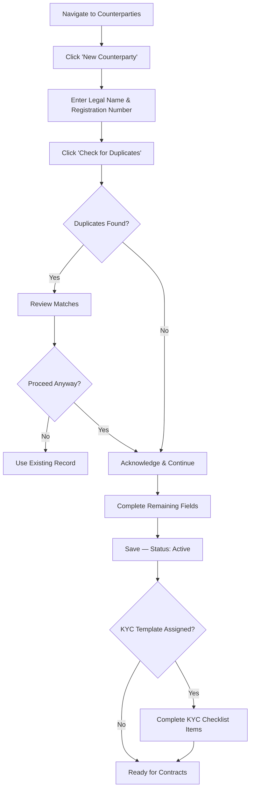
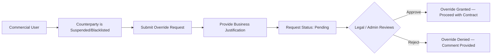
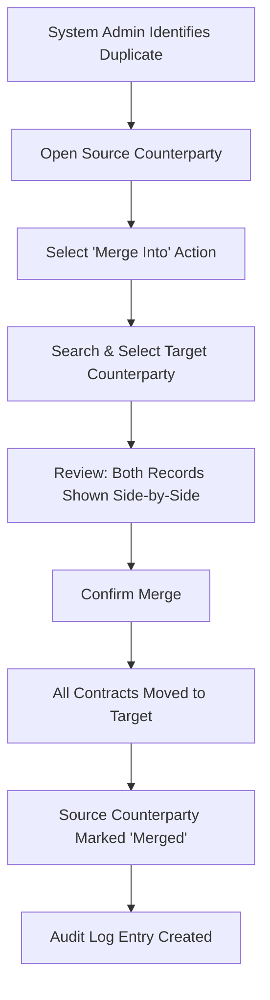

# Counterparty Management

Counterparties are the organisations and individuals that are parties to your contracts. CCRS provides a complete set of tools for onboarding counterparties, detecting duplicates, managing compliance status, and maintaining contact information -- all from a single interface.

---

## Creating a Counterparty

To add a new counterparty to the system:

1. Navigate to **Counterparties** in the left sidebar.
2. Click the **"New Counterparty"** button in the top-right corner of the list page.
3. Fill in the required fields:
   - **Legal Name** -- the full legal name of the organisation or individual.
   - **Registration Number** -- the company registration or incorporation number.
4. Optionally complete the remaining fields:
   - **Jurisdiction** -- the legal jurisdiction in which the counterparty is registered.
   - **Description** -- any additional context or notes about the counterparty.
5. **Before saving**, click the **"Check for Duplicates"** button to verify that this counterparty does not already exist in the system (see the next section for details).
6. Once you are satisfied there is no duplicate, click **Save**. The counterparty is created with a status of **Active**.

### Who Can Create Counterparties?

Users with the **System Admin**, **Legal**, or **Commercial** role can create new counterparty records.

### Onboarding Flow

The diagram below shows the full onboarding process, including duplicate checking and KYC assignment.

---

## Duplicate Detection

Duplicate counterparty records create confusion and split contract history across multiple entries. CCRS includes built-in duplicate detection to prevent this.

### How It Works

When you click the **"Check for Duplicates"** button on the counterparty creation form, CCRS performs a server-side search that:

- **Fuzzy-matches the Legal Name** -- finds counterparties with similar (not necessarily identical) names, accounting for minor spelling variations, abbreviations, and word order differences.
- **Exact-matches the Registration Number** -- finds any existing counterparty with the same registration number, which is a strong indicator of a true duplicate.

### Reviewing Results

If potential duplicates are found, a modal dialog appears showing:

- The **matching counterparty records** with their legal name, registration number, jurisdiction, and current status.
- A **match confidence indicator** so you can assess how likely it is that the match is a true duplicate.

You then have two choices:

1. **Use the existing record** -- close the form and navigate to the matching counterparty instead. This is the recommended action when a true duplicate is detected.
2. **Acknowledge and continue** -- if you have determined that the match is a false positive (for example, two distinct companies with similar names), you can acknowledge the finding and proceed with creating the new record.

---

## Status Management

Every counterparty has one of three statuses that controls whether new contracts can be created against them.

| Status | Meaning | Contract Creation |
|---|---|---|
| **Active** | The counterparty is in good standing. | Allowed -- no restrictions. |
| **Suspended** | A temporary restriction has been placed on the counterparty. | Blocked -- requires an approved **Override Request**. |
| **Blacklisted** | A permanent restriction has been placed on the counterparty. | Blocked -- requires an approved **Override Request**. |

### Changing Status

**System Admin** and **Legal** users can change a counterparty's status from the counterparty edit page. When a counterparty is moved to Suspended or Blacklisted, any attempt to associate them with a new contract will be blocked until an override is granted.

---

## Override Requests

When a Commercial user needs to create a contract with a **Suspended** or **Blacklisted** counterparty, they must submit an Override Request for approval.

### Submitting a Request

1. When you attempt to use a restricted counterparty, the system will prompt you to submit an override request.
2. Provide a **business justification** -- a clear explanation of why the restriction should be waived for this particular contract.
3. The request is created with a status of **Pending** and routed to Legal and System Admin users for review.

### Review and Decision

A **Legal** or **System Admin** user reviews the override request and takes one of two actions:

- **Approve** -- the override is granted and the Commercial user can proceed with creating the contract against the restricted counterparty.
- **Reject** -- the override is denied. The reviewer provides a **comment** explaining the reason for rejection.

The requesting user is notified of the outcome.

### Approval Flow

---

## Merging Counterparties (Admin Only)

Over time, duplicate counterparty records may be discovered -- for example, the same company entered under slightly different names. System Admins can merge these records to consolidate contract history.

### How to Merge

1. Open the **source** counterparty (the duplicate record you want to eliminate).
2. Select the **"Merge Into"** action.
3. Search for and select the **target** counterparty (the record you want to keep).
4. Review both records displayed **side-by-side** to confirm the merge is correct.
5. Click **Confirm** to execute the merge.

### What Happens During a Merge

- All **contracts** associated with the source counterparty are transferred to the target counterparty.
- The source counterparty's status is changed to **Merged**, with a reference to the target record.
- An **audit log entry** is created recording the merge, including who performed it and when.

### Important

Merging is **irreversible**. Once a merge is confirmed, the source counterparty cannot be restored to its original state. Always verify both records carefully before confirming.

### Merge Flow

---

## Contacts

Each counterparty can have multiple **contacts** -- the people you interact with at that organisation. Contacts are managed from the counterparty's edit page.

### Contact Fields

| Field | Description |
|---|---|
| **Name** | The contact's full name. |
| **Email** | The contact's email address. |
| **Phone** | The contact's phone number. |
| **Position** | The contact's role or job title at the counterparty organisation. |

### Managing Contacts

1. Open the counterparty record and navigate to the **Contacts** tab (relation manager).
2. Click **"Add Contact"** to create a new contact entry.
3. Fill in the contact details and save.
4. To edit or remove an existing contact, use the action buttons on the contact row.

Contacts are used throughout the system -- for example, when setting up signing sessions or sending notifications related to a contract.

---

## Stored Signatures

CCRS allows administrators to manage **stored signatures** for counterparty representatives. These pre-captured signatures can be applied during contract signing sessions, streamlining the execution process.

### Who Can Manage Stored Signatures?

Only **System Admin** and **Legal** users can create, edit, or delete stored signatures for a counterparty.

### Managing Stored Signatures

1. Open the counterparty record and navigate to the **"Stored Signatures"** tab.
2. From this tab you can add new signatures, view existing ones, or remove signatures that are no longer valid.
3. When a signing session is initiated for a contract involving this counterparty, the stored signatures are available for selection.

---

## KYC Compliance

Know Your Customer (KYC) compliance ensures that adequate due diligence has been performed on a counterparty before entering into contracts with them.

### KYC Templates

A **KYC Template** defines a checklist of items required for counterparty due diligence. Templates are configured by System Admins and typically include items such as:

- Proof of incorporation or registration
- Identification documents for directors or beneficial owners
- Financial statements or references
- Sanctions screening results

### KYC Packs

When a KYC Template is **assigned to a counterparty**, CCRS creates a **KYC Pack** -- an instance of that template linked to the specific counterparty. The KYC Pack contains individual checklist items that must be completed.

### Completing KYC

1. **Legal** users review the KYC Pack on the counterparty's record.
2. Each checklist item is marked as **complete** once the required documentation or verification has been obtained.
3. Progress is tracked at the pack level so you can see at a glance how many items are outstanding.
4. Once all items are complete, the counterparty's KYC status is satisfied and they are fully onboarded for contract activity.

---

## Summary of Role Permissions

The table below summarises which roles can perform key counterparty management actions.

| Action | System Admin | Legal | Commercial | Finance | Operations | Audit |
|---|---|---|---|---|---|---|
| Create counterparty | Yes | Yes | Yes | -- | -- | -- |
| Edit counterparty | Yes | Yes | -- | -- | -- | -- |
| Change status | Yes | Yes | -- | -- | -- | -- |
| Merge counterparties | Yes | -- | -- | -- | -- | -- |
| Submit override request | -- | -- | Yes | -- | -- | -- |
| Review override request | Yes | Yes | -- | -- | -- | -- |
| Manage stored signatures | Yes | Yes | -- | -- | -- | -- |
| Complete KYC checklist | -- | Yes | -- | -- | -- | -- |
| View counterparty records | Yes | Yes | Yes | -- | -- | -- |
