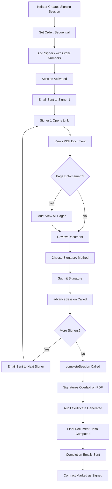
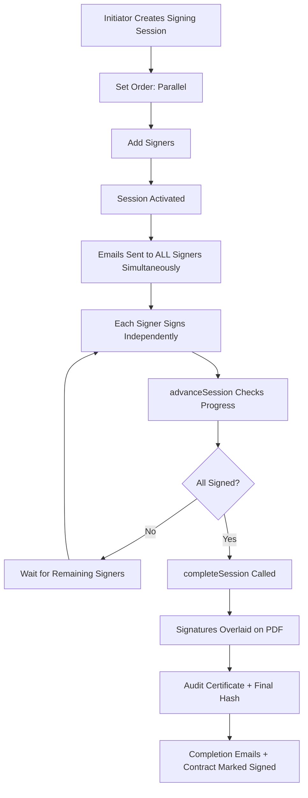
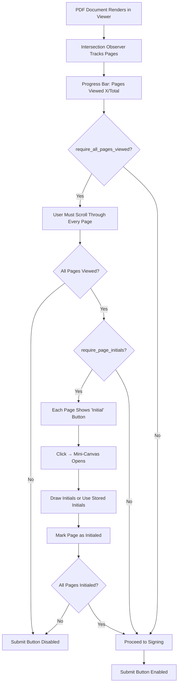
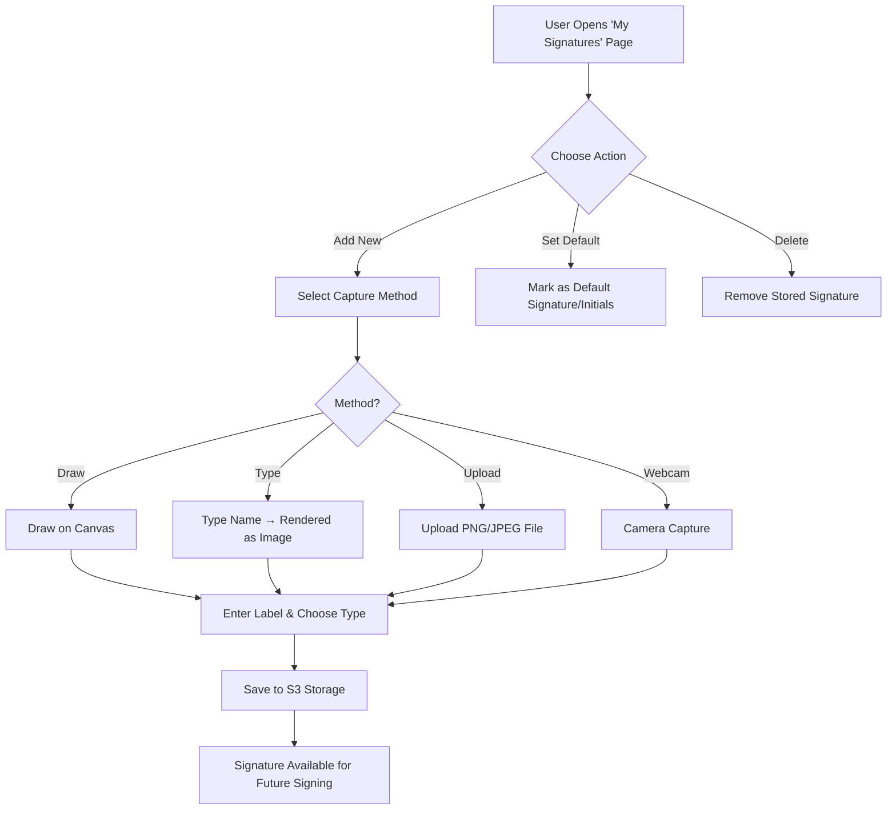

# 5. Electronic Signing

## Overview

CCRS includes a full in-house electronic signing system. No external signing providers (DocuSign, Adobe Sign, etc.) are required. The system supports sequential and parallel signing orders, four signature capture methods, stored signatures for repeat use, template-based signing blocks, page enforcement controls, and a complete audit trail with document integrity verification.

Every signing action -- creating a session, viewing the document, signing, declining, sending reminders -- is recorded in the audit log with the actor's IP address and user agent string.

---

## Creating a Signing Session

When a contract has been approved and is ready for execution, the initiator creates a signing session from the contract's action menu.

1. Navigate to the contract and click **Send for Signing** in the action menu.
2. Choose the **signing order**:
   - **Sequential** -- signers receive their invitations one at a time, in the order you specify.
   - **Parallel** -- all signers receive their invitations simultaneously.
3. Add signers. For each signer, provide:
   - **Name** -- the signer's full name.
   - **Email** -- the email address where the invitation will be sent.
   - **Type** -- Internal (a user within your organisation) or External (a counterparty or third party).
   - **Order** -- the signing position (used in sequential mode to determine who signs first, second, etc.).
4. Configure optional enforcement settings:
   - **Require all pages viewed** -- signers must scroll through every page of the PDF before the submit button becomes available.
   - **Require page initials** -- signers must initial each page of the document before they can submit their final signature.
5. Review the session details and activate it.

If the contract was generated from a WikiContract template that has pre-defined signing blocks, the signature field positions are auto-populated -- you do not need to place them manually.

The session is valid for **30 days** from creation. Individual signer tokens expire after **7 days**, after which the initiator can resend the invitation.

---

## Sequential vs Parallel Signing

### Sequential Signing

In sequential mode, each signer receives their email invitation only after the previous signer in the order has completed their signature. This is the appropriate choice when a specific signing order is required -- for example, when the counterparty must sign before the company countersigns.

### Parallel Signing

In parallel mode, all signers receive their email invitations at the same time and can sign in any order. The session completes automatically once every signer has submitted their signature. This mode is faster when no particular signing order is required.

---

## The Signer's Experience

External signers do not need a CCRS account. They receive a magic-link email invitation and interact with the signing page directly. The step-by-step experience is as follows:

1. **Receive email** -- the signer receives an email containing a signing invitation link. The link includes a unique, cryptographically generated token.
2. **Open the signing page** -- clicking the link opens the CCRS signing page in the browser. No login is required.
3. **View the contract PDF** -- the full contract document is displayed in an embedded PDF viewer.
4. **Scroll through pages (if required)** -- if page enforcement is enabled, a progress bar shows "Pages viewed: X/Y". The signer must scroll through every page before the submit button becomes active.
5. **Initial each page (if required)** -- if page initials are required, each page displays an "Initial" button. Clicking it opens a mini-canvas where the signer draws their initials (or selects previously stored initials). The progress indicator shows "Pages initialed: X/Y".
6. **Choose a signature method** -- the signer selects one of four capture methods: Draw, Type, Upload, or Camera. If the signer has previously stored signatures in CCRS, those appear for one-click selection.
7. **Review and submit** -- the signer reviews their signature and clicks Submit.
8. **Save for future use (optional)** -- after signing, a "Save this signature for future use" checkbox is offered. Checking it stores the signature for faster signing next time.
9. **Confirmation** -- a confirmation message is displayed, and the signer receives a confirmation email.

### Page Enforcement in Detail

Page enforcement gives the initiator control over how thoroughly signers must review the document before signing.

- **Viewing requirement** -- when `require_all_pages_viewed` is enabled, the system uses a browser Intersection Observer to track which pages the signer has scrolled past. The submit button remains disabled until every page has been seen.
- **Page initials** -- when `require_page_initials` is enabled, each page of the PDF displays an "Initial" button. Clicking the button opens a mini-canvas overlay where the signer draws their initials. If the signer has stored initials marked as default, those are applied automatically with a single click.
- **Progress indicators** -- the signing page displays real-time progress: "Pages viewed: 3/12" and "Pages initialed: 3/12".

---

## Declining to Sign

A signer can choose to decline rather than sign. The process is as follows:

1. On the signing page, click **Decline**.
2. Provide a **reason** for declining (required).
3. The decline is recorded in the audit log with the signer's IP address and user agent.
4. The session initiator receives an email notification that the signer has declined, along with the stated reason.
5. The signer's status is updated to "declined". A declined signer cannot later sign or re-decline.

Depending on the session configuration, a decline may halt the entire signing process (in sequential mode, subsequent signers will not receive their invitations).

---

## Signature Capture Methods

CCRS supports four methods for capturing signatures. All four produce a PNG image that is overlaid on the PDF at the designated signing position.

### Draw

The signer draws their signature on an HTML canvas using a mouse, trackpad, or touchscreen. This is the most common method and works on all devices.

- A clear button allows the signer to start over.
- The canvas captures smooth strokes in real time.

### Type

The signer types their name, and CCRS renders it as a signature-style image using a script font. This method is the fastest and most convenient when a handwritten appearance is not critical.

### Upload

The signer uploads an existing PNG or JPEG file containing their signature. This is useful for signers who have a pre-prepared signature image -- for example, a scan of their handwritten signature.

### Camera / Webcam

The signer uses their device's camera to photograph a handwritten signature on paper. CCRS processes the captured image to produce a clean, transparent-background signature.

```mermaid
flowchart LR
    A[Click Camera Tab] --> B[Browser Requests Camera Access]
    B --> C[Live Video Preview Shown]
    C --> D[Hold Paper with Signature to Camera]
    D --> E[Click Capture Button]
    E --> F[Frame Grabbed from Video]
    F --> G[Convert to Grayscale]
    G --> H[Apply Threshold Filter]
    H --> I[Remove Light Background → Transparent]
    I --> J[Preview Processed Image]
    J --> K{Accept?}
    K -->|No| C
    K -->|Yes| L[Signature Ready for Use]
```

The image processing pipeline works as follows:

1. A single frame is captured from the video feed.
2. The image is converted to grayscale.
3. A threshold filter is applied to isolate the dark ink of the signature from the lighter background of the paper.
4. Light pixels (the paper background) are made transparent, leaving only the signature strokes.
5. The processed image is previewed. The signer can accept it or re-capture.

---

## Stored Signatures

CCRS allows users and signers to save their signatures for future use, eliminating the need to re-draw or re-capture each time.

### Managing Stored Signatures

The **My Signatures** page is accessible from the user menu. From this page, users can:

- **Add a new signature or initials** using any of the four capture methods (Draw, Type, Upload, Camera).
- **Set a default** -- mark one signature and one initials as the default. Defaults are automatically pre-selected during signing.
- **Delete** stored signatures that are no longer needed.

### Using Stored Signatures During Signing

When a signer opens a signing page and has stored signatures on file, the following behaviour applies:

- Stored signatures are displayed in a selection panel alongside the capture method tabs.
- The default signature (if set) is pre-selected.
- The signer can click a stored signature to use it immediately, or switch to any capture method to create a new one.

### Save for Future Use

After completing a signature on a signing page, the signer is offered a **"Save this signature for future use"** checkbox. Checking it creates a new stored signature record linked to the signer's email address (for external signers) or user account (for internal signers).

---

## Template Signing Blocks

When contracts are generated from WikiContract templates, the template can pre-define the positions and types of signing fields on the document.

### How Template Fields Work

Each template signing field specifies:

| Property | Description |
|---|---|
| **Field type** | Signature, Initials, Text, or Date |
| **Signer role** | Who fills this field: `company`, `counterparty`, `witness_1`, `witness_2`, etc. |
| **Page number** | Which page of the PDF the field appears on |
| **Position** | X/Y coordinates and width/height for the field placement |
| **Required** | Whether the field must be filled before submission |

### Role-to-Signer Mapping

When a signing session is created from a template-based contract, CCRS automatically maps template roles to signers:

| Template Role | Maps To |
|---|---|
| `company` | Internal signer (the company's authorised signatory) |
| `counterparty` | External signer (the other party to the agreement) |
| `witness_1` | First additional signer (typically a witness) |
| `witness_2` | Second additional signer |
| `witness_3` | Third additional signer |

This mapping means the initiator does not need to manually place signing fields -- they are inherited from the template and automatically assigned to the correct signers.

### Non-Template Contracts

For contracts that were not generated from a template (e.g., uploaded PDFs), the initiator can manually add signing fields during session creation, specifying the field type, page, position, and which signer is responsible for each field.

---

## Session Completion

When all signers have submitted their signatures, the system automatically finalises the signing session. The completion process involves five steps:

1. **Signature overlay** -- all collected signatures are overlaid onto the original PDF document at their designated positions (as defined by template fields or manual placement).
2. **Audit certificate** -- a separate PDF document is generated summarising the signing session: who signed, when they signed, their IP addresses, the signature method used, and the document hash.
3. **Final document hash** -- a SHA-256 hash of the completed, signed PDF is computed and stored. This hash can be used to verify that the document has not been altered after signing.
4. **Notification emails** -- completion emails are sent to all signers and the session initiator, confirming that signing is complete.
5. **Contract status update** -- the contract's signing status is updated to "signed", and the contract advances to the next lifecycle state.

The final signed PDF and audit certificate are stored securely. The original unsigned document is preserved alongside the signed version for reference.

---

## Reminders

If a signer has not acted on their invitation, the session initiator can send a reminder:

- Navigate to the signing session and click **Send Reminder** next to the pending signer.
- A new email is sent to the signer with the same signing link.
- The reminder is recorded in the audit log.
- Reminders do not reset the token expiry. If the 7-day token has expired, a new invitation must be sent instead.

---

## Session Cancellation

The session initiator can cancel an active signing session at any time:

- Navigate to the signing session and click **Cancel Session**.
- All pending signer tokens are invalidated.
- Signers who have not yet signed can no longer access the signing page.
- Signatures already collected are preserved in the audit record but are not applied to the contract.
- The contract returns to its previous workflow state.

---

## Security

The signing system is designed with multiple layers of security to ensure document integrity and signer authenticity.

### Token Security

- **CSPRNG tokens** -- signing invitation tokens are generated using a cryptographically secure pseudo-random number generator.
- **SHA-256 hashed storage** -- only the SHA-256 hash of each token is stored in the database. The plaintext token appears only in the email link. This means that even if the database is compromised, tokens cannot be extracted.
- **Token expiry** -- individual signer tokens expire after **7 days**. The overall session expires after **30 days**.
- **Single use** -- once a signer has signed or declined, the token cannot be reused for a different action.

### Document Integrity

- **Hash at creation** -- a SHA-256 hash of the original document is computed when the signing session is created.
- **Hash at completion** -- a SHA-256 hash of the final signed document is computed and stored.
- **Tamper detection** -- the creation hash can be compared against the original file to verify that the document presented to signers was not altered during the signing process.

### Audit Trail

Every significant action is logged in the signing audit log:

| Event | Details Captured |
|---|---|
| Session created | Initiator, contract, signing order, settings |
| Invitation sent | Signer email, timestamp |
| Document viewed | Signer, timestamp, IP address, user agent |
| Signature submitted | Signer, method, timestamp, IP address, user agent |
| Signing declined | Signer, reason, timestamp, IP address, user agent |
| Session completed | Final document hash, timestamp |
| Session cancelled | Cancelled by, reason, timestamp |
| Reminder sent | Signer email, timestamp |

### Signature Storage

- Signature images are stored securely in S3-compatible object storage.
- Stored signatures are accessible only to the owning user.
- Signature images are not publicly accessible -- they are served through authenticated routes.
