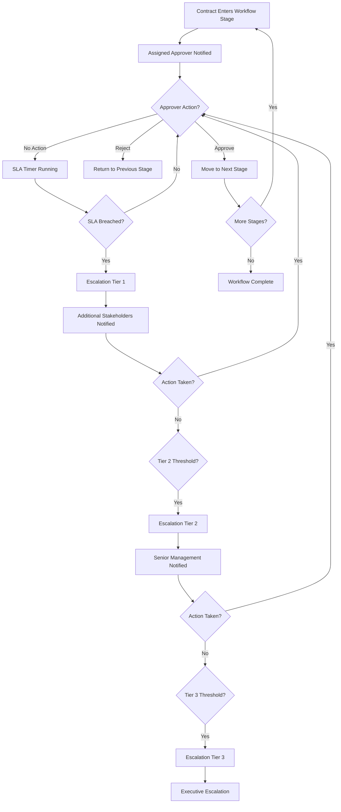

# 6. Workflow Templates

## Overview

Workflow templates define the sequence of approval stages a contract moves through from submission to execution. Each template is a reusable blueprint that specifies:

- **Which stages apply** -- Review, Legal Approval, Finance Sign-off, Executive Approval, etc.
- **Who is responsible at each stage** -- defined by role (e.g. Legal, Finance, Operations).
- **How long each stage should take** -- an SLA expressed in days.
- **Whether approval is required** -- some stages may be informational; others require explicit sign-off before the contract can proceed.
- **What happens when SLAs are breached** -- escalation rules that notify progressively senior stakeholders.

Templates are created and managed exclusively by **System Admin** users. Once published, a template automatically assigns itself to new contracts that match its contract type and organizational scope.

---

## Workflow Approval Flow with Escalation

The diagram below illustrates how a contract moves through a single workflow stage, including the escalation path when an approver does not act within the SLA window.

---

## Creating a Workflow Template (Admin Only)

Only users with the **System Admin** role can create, edit, publish, or delete workflow templates. Follow these steps to create a new template.

### Step-by-Step

1. **Navigate to Workflows** -- In the left sidebar, expand the Workflows section and click **Workflow Templates**.
2. **Click "New"** -- Use the "New" button in the top-right corner of the list page.
3. **Enter template name and description** -- Choose a clear, descriptive name (e.g. "Commercial Contract -- EMEA Standard Approval") and a summary of the template's purpose.
4. **Select contract type** -- Choose either *Commercial* or *Merchant*. This determines which contracts the template can be assigned to.
5. **Optionally scope to a Region, Entity, or Project** -- Select one or more of these to restrict the template to a specific part of the organization. Leave all three blank to create a global template that applies to any contract of the selected type.
6. **Build the workflow stages** -- Use the Visual Workflow Builder (drag-and-drop) or the AI Generation feature to define the sequence of approval stages. See the sections below for details on each approach.
7. **Configure escalation rules** -- For each stage, define what happens when the SLA is breached. Up to three escalation tiers can be configured per stage.
8. **Save as draft** -- The template is saved but not yet active. Review the complete stage sequence and escalation configuration.
9. **Publish** -- When satisfied, publish the template. Only published templates auto-assign to new contracts.

---

## Visual Workflow Builder

The visual workflow builder provides a drag-and-drop interface for constructing the approval stages of a template. It is the primary tool for building and editing workflow stage sequences.

### How It Works

- **Adding stages** -- Click the "Add Stage" button to append a new stage to the sequence. Each stage is represented as a card in the builder.
- **Stage configuration** -- Each stage card has the following fields:

| Field | Description |
|---|---|
| **Name** | A descriptive label for the stage (e.g. "Legal Review", "Finance Sign-off"). |
| **Responsible Role** | The role whose members will be assigned as approvers for this stage. |
| **Duration (days)** | The SLA for this stage -- the number of days within which the approver should act. |
| **Requires Approval** | A toggle that determines whether the stage requires an explicit approval action before the contract can advance to the next stage. When disabled, the stage is informational only. |

- **Reordering stages** -- Drag a stage card up or down in the list to change its position in the sequence. The order in the builder is the order in which stages will be executed.
- **Removing stages** -- Click the delete button on a stage card to remove it from the sequence.
- **Preview** -- The builder shows a preview of the complete flow, allowing you to verify the stage sequence before saving or publishing.

---

## AI Workflow Generation

For users who prefer to describe a workflow in natural language rather than building it manually, CCRS provides an AI-powered generation feature.

### How to Use

1. On the workflow template creation or edit form, click the **"Generate with AI"** button.
2. In the text field that appears, describe the desired workflow in plain English. For example:
   > "Three-stage approval: legal review for 5 days, then finance sign-off for 3 days, then executive approval for 2 days. All stages require approval."
3. Click **Generate**. The AI processes your description and produces a stages JSON structure.
4. The generated stages appear in the visual workflow builder, where you can review, adjust, reorder, or remove them as needed.
5. Once you are satisfied with the result, save and publish the template.

### Tips for Better Results

- Be specific about stage names, responsible roles, and durations.
- Mention whether each stage requires approval or is informational.
- Include any special requirements (e.g. "the final stage should go to the CFO").
- You can regenerate as many times as needed -- the AI output replaces the current stages each time.

---

## Publishing and Versioning

Workflow templates follow a draft-to-published lifecycle with automatic version tracking.

### Draft State

- New templates and unpublished edits are saved in **draft** state.
- Draft templates do **not** auto-assign to new contracts.
- You can freely edit stages, escalation rules, and metadata while a template is in draft.

### Publishing

- When you publish a template, it becomes active and eligible for auto-assignment to new contracts.
- Publishing **increments the version number** automatically (v1, v2, v3, etc.).
- Previous versions are preserved in the system for audit purposes.

### Editing a Published Template

- Editing a published template creates a new draft version.
- The currently published version remains active and continues to auto-assign until the new version is published.
- Existing contract workflows that were assigned from a previous version are **not affected** by publishing a new version -- they continue using the version that was active when they were assigned.

---

## Template Matching

When a new contract is saved in **Draft** state, CCRS automatically searches for the most specific published workflow template that matches the contract's attributes. The matching algorithm follows a priority order from most specific to least specific:

1. **Contract type** (required) -- the template must match the contract's type (Commercial or Merchant).
2. **Project** (most specific) -- if a template is scoped to the contract's project, it takes priority.
3. **Entity** -- if no project-specific template exists, a template scoped to the contract's entity is used.
4. **Region** -- if no entity-specific template exists, a template scoped to the contract's region is used.
5. **Global** (least specific) -- if no scoped template matches, a global template (one with no region, entity, or project) is used.

If no published template matches at any level, the contract remains in **Draft** state without a workflow assignment. An administrator must create and publish a matching template before the contract can progress through its lifecycle.

### How Auto-Assignment Works

When a matching published template is found:

1. A **WorkflowInstance** is created, linking the contract to the template.
2. The contract's **workflow state** is set based on the first stage defined in the template.
3. The **approvers** for the first stage are notified per the template's role configuration.
4. The **SLA timer** begins for the first stage.

> **Tip:** Create your Regions, Entities, and Projects before creating workflow templates, so you can scope them correctly. Templates cannot be scoped to organizational units that do not yet exist.

---

## Escalation Rules

Escalation rules ensure that contracts do not stall indefinitely at any stage. When an approver does not act within the SLA window, the system automatically escalates the item to additional stakeholders.

### Configuration

Each workflow stage can have up to **three escalation tiers**, configured independently:

| Tier | Typical Threshold | Who Is Notified | Purpose |
|---|---|---|---|
| **Tier 1** | e.g. 48 hours after SLA breach | Additional stakeholders in the same role or department | Draw attention to the stalled item and encourage action. |
| **Tier 2** | e.g. 72 hours after SLA breach | Senior management | Involve management to resolve the delay. |
| **Tier 3** | e.g. 96 hours after SLA breach | Executive leadership | Final escalation for items that remain unresolved. |

### How Escalation Works

1. When a stage's SLA expires without an approval or rejection action, the system triggers **Tier 1** escalation.
2. The roles specified in the Tier 1 notification list receive an alert via the configured channels (email, Microsoft Teams, or both).
3. If the item remains unresolved after the Tier 2 threshold, Tier 2 escalation fires and notifies senior management.
4. If the item still has no resolution after the Tier 3 threshold, Tier 3 escalation fires with executive-level notification.
5. Each escalation event is recorded as an **EscalationEvent** in the system for audit and reporting purposes.

### Viewing Escalated Items

- Escalated contracts appear on the **Escalations** page, accessible from the left sidebar.
- Each escalated item shows the contract name, current stage, escalation tier, time since breach, and the roles that have been notified.
- Priority indicators help you quickly identify the most critical items.

---

## Summary of Key Concepts

| Concept | Description |
|---|---|
| **Workflow Template** | A reusable blueprint defining the stages, roles, SLAs, and escalation rules for contract approval. |
| **Stage** | A single step in the workflow (e.g. "Legal Review") with a responsible role, duration, and approval requirement. |
| **Escalation Rule** | A time-based trigger that notifies additional stakeholders when a stage's SLA is breached. |
| **Workflow Instance** | An active workflow linked to a specific contract, created when the template auto-assigns. |
| **Stage Action** | An approval or rejection recorded by an approver at a specific stage. |
| **Template Matching** | The process by which the system finds the most specific published template for a new contract. |
| **Version** | Each publish of a template increments its version number; previous versions are preserved. |

---

## Role Permissions

| Action | System Admin | Legal | Commercial | Finance | Operations | Audit |
|---|---|---|---|---|---|---|
| Create workflow template | Yes | -- | -- | -- | -- | -- |
| Edit workflow template | Yes | -- | -- | -- | -- | -- |
| Publish workflow template | Yes | -- | -- | -- | -- | -- |
| Delete workflow template | Yes | -- | -- | -- | -- | -- |
| View workflow templates | Yes | Yes | Yes | Yes | Yes | Yes |
| Act as stage approver | Yes | Yes | Yes | Yes | Yes | -- |
| View escalated items | Yes | Yes | Yes | Yes | Yes | Yes |
