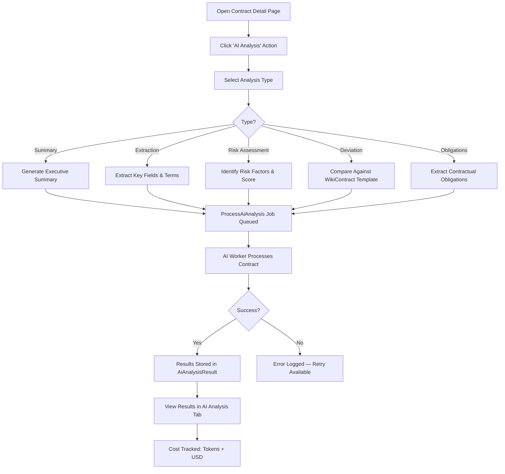
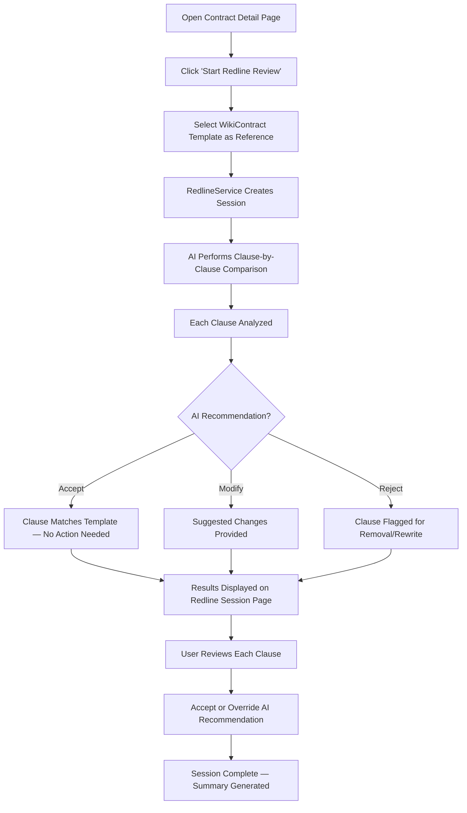

# 7. AI Analysis & Redlining

## Overview

CCRS integrates AI-powered contract analysis through a dedicated Python FastAPI microservice (the AI Worker). The AI engine can analyse contracts in five different ways, each producing structured results that are stored against the contract record. All analyses track token usage and cost in USD, giving Finance and Admin users full visibility into AI spend for budget management.

Analysis results are stored as `AiAnalysisResult` records and linked to the originating contract. For field-level extraction, individual `AiExtractedField` records capture each extracted value along with a confidence score. Every analysis records the model used, tokens consumed, and estimated cost.

---

## Five Analysis Types

CCRS supports five distinct AI analysis types. Each type produces a different kind of output tailored to a specific stage of the contract review process.

| Analysis Type | What It Produces | Typical Use Case |
|---|---|---|
| **Summary** | An executive summary of the contract's key points, parties, terms, and obligations in plain language | Quick orientation for reviewers who need to understand a contract without reading the full document |
| **Extraction** | Structured fields (party names, dates, monetary values, terms) with a confidence score for each extracted field | Populating contract metadata, verifying that key terms match expectations |
| **Risk Assessment** | Identified risk factors, risk scores, and mitigation recommendations | Legal review to flag problematic clauses before approval |
| **Deviation Analysis** | A clause-by-clause comparison of the contract text against a WikiContract reference template, highlighting deviations from standard terms | Ensuring that negotiated contracts have not drifted from approved templates |
| **Obligations** | All contractual obligations with due dates, responsible parties, and compliance requirements | Operations and compliance teams tracking what must be delivered and by when |

### AI Analysis Trigger and Results Flow

---

## Triggering an Analysis

Follow the steps below to run an AI analysis on a contract. Analyses can be triggered from any contract in the **Draft** or **Review** state.

### Step-by-Step

1. **Navigate to the contract detail page** -- Open the contract you want to analyse from the Contracts list.
2. **Click the "AI Analysis" action button** -- This is available in the contract's action bar at the top of the detail page.
3. **Select the analysis type from the dropdown** -- Choose one of the five types: Summary, Extraction, Risk Assessment, Deviation Analysis, or Obligations.
4. **For Deviation Analysis, select the WikiContract template** -- A dropdown lists all available WikiContract reference templates. Choose the template that represents the standard terms you want to compare against.
5. **Click "Run Analysis"** -- The analysis is submitted.
6. **Monitor the status** -- The analysis is queued as a background job. You will see the status change through three stages:
   - **Pending** -- The job has been created and is waiting in the queue.
   - **Processing** -- The AI Worker microservice is actively analysing the contract.
   - **Completed** -- Results are ready to view.
   - If the analysis fails, the status changes to **Failed** with an error message. You can retry the analysis from the same screen.
7. **View results** -- Once completed, results appear in the **AI Analysis** tab on the contract detail page.

You can run multiple analysis types on the same contract. Each analysis creates a separate result record.

---

## Viewing Results

Analysis results are displayed in the **AI Analysis** relation manager tab on the contract detail page. This tab lists all analyses that have been run on the contract.

### Results List

Each result row shows:

| Column | Description |
|---|---|
| **Analysis Type** | Summary, Extraction, Risk Assessment, Deviation, or Obligations |
| **Status** | Pending, Processing, Completed, or Failed |
| **Date** | When the analysis was triggered |
| **Model Used** | The AI model that processed the analysis |
| **Tokens Used** | The number of tokens consumed by the analysis |
| **Cost (USD)** | The estimated cost of the analysis in US dollars |

### Viewing Full Results

Click on any completed result to view the full analysis output. The output format varies by analysis type:

- **Summary** -- A structured narrative covering key parties, terms, obligations, and notable provisions.
- **Extraction** -- A table of extracted fields. Each field shows the field name, extracted value, and a confidence score (0--100%). Higher confidence scores indicate greater certainty in the extraction.
- **Risk Assessment** -- A list of identified risk factors, each with a severity score and recommended mitigation actions.
- **Deviation Analysis** -- A comparison showing which clauses deviate from the WikiContract template, with the original template text alongside the contract text.
- **Obligations** -- A structured list of obligations with due dates, responsible parties, and compliance criteria.

### Failed Analyses

If an analysis fails, the result record includes an **error message** explaining the failure. Common causes include:

- The contract document could not be parsed (corrupted or unsupported format).
- The AI Worker microservice was temporarily unavailable.
- The contract text exceeded the model's context window.

Click **Retry** on a failed analysis to re-queue the job.

---

## Cost Tracking

Every AI analysis records the number of tokens consumed and the estimated cost in USD. This data is available at the individual result level and in aggregate through the AI Cost Report.

### Per-Analysis Cost

Each `AiAnalysisResult` record stores:

- **tokens_used** -- The total token count (input + output) for the analysis.
- **cost_usd** -- The estimated cost based on the model's per-token pricing.
- **model_used** -- The specific AI model that processed the request.

### AI Cost Report Page

The **AI Cost Report** page is available under the Reports navigation group. Access is restricted to users with the **Finance** or **System Admin** role.

The report provides:

- **Breakdown by analysis type** -- See which analysis types consume the most tokens and cost.
- **Breakdown by contract** -- Identify which contracts have required the most AI processing.
- **Breakdown by time period** -- Track spending trends over days, weeks, or months.
- **Total spend** -- Aggregate cost across all analyses for budget monitoring.

Use this report to manage AI usage across the organisation and set expectations for monthly AI processing budgets.

---

## Redline Review

Redline Review is an AI-powered clause-by-clause comparison of a contract against a reference WikiContract template. It produces actionable recommendations for each clause, helping Legal teams quickly identify non-standard terms and decide how to proceed.

### When to Use Redline Review

Use Redline Review when:

- You are reviewing a counterparty-drafted contract against your standard terms.
- You need to identify which clauses deviate from an approved template.
- Legal wants a structured, clause-level comparison rather than a high-level deviation summary.

Redline Review is more granular than Deviation Analysis. While Deviation Analysis provides an overview of differences, Redline Review breaks the comparison down to individual clauses with specific recommendations.

### Redline Review Session Flow

### How to Run a Redline Review

1. **Open the contract detail page** -- Navigate to the contract you want to redline.
2. **Click "Start Redline Review"** -- This action is available for contracts in Draft or Review state.
3. **Select the WikiContract template** -- Choose the reference template that represents your standard terms. The template serves as the baseline for comparison.
4. **Wait for processing** -- The RedlineService creates a session and sends each clause to the AI for comparison. Processing time depends on the length of the contract.
5. **Review the results** -- Once complete, the Redline Session page displays each clause with a side-by-side comparison.

### Understanding Redline Results

Each clause in the session receives one of three AI recommendations:

| Recommendation | Meaning | Action Required |
|---|---|---|
| **Accept** | The clause matches or is substantially equivalent to the template clause. | No action needed -- the clause conforms to standard terms. |
| **Modify** | The clause differs from the template in ways that may need adjustment. The AI provides suggested changes. | Legal reviews the suggested modification and decides whether to incorporate it. |
| **Reject** | The clause is significantly different from standard terms and may need to be removed or completely rewritten. | Legal evaluates whether the clause is acceptable or must be renegotiated. |

### Reviewing and Overriding Recommendations

For each clause in the session:

- Review the **original text** (from the WikiContract template) alongside the **contract text**.
- Read the AI's **analysis** explaining why it made the recommendation.
- **Accept the recommendation** to mark the clause as reviewed and agree with the AI's assessment.
- **Override the recommendation** if you disagree with the AI's assessment. You can change the status of any clause regardless of what the AI recommended.

Once all clauses have been reviewed, the session is marked as complete and a summary of findings is generated.

---

## WikiContract Templates

WikiContract templates are reference documents that represent your organisation's standard contract terms. They serve as baselines for both Deviation Analysis and Redline Review.

### Purpose

- Establish a single source of truth for standard contractual language.
- Enable consistent comparison across all contracts reviewed by the organisation.
- Reduce legal review time by automating the identification of non-standard clauses.

### Management

WikiContract templates are managed by users with the **Legal** or **System Admin** role. Key capabilities include:

- **Create templates** -- Draft new WikiContract templates covering different contract types or jurisdictions.
- **Edit templates** -- Update template language as standard terms evolve.
- **Template signing blocks** -- Define field positioning for signature blocks, specifying where signing fields should appear during the electronic signing process.
- **Version control** -- Maintain current versions of templates so that analyses always compare against the latest approved standard terms.

### Using Templates

WikiContract templates are referenced in two contexts:

1. **Deviation Analysis** -- When running a Deviation Analysis on a contract, select the appropriate WikiContract template to compare against. The AI highlights where the contract's terms diverge from the template.
2. **Redline Review** -- When starting a Redline Review session, select the WikiContract template as the baseline. The AI performs a clause-by-clause comparison and provides Accept, Modify, or Reject recommendations for each clause.

Choose the template that most closely matches the contract type being reviewed. For example, use a merchant agreement template when reviewing merchant contracts and a vendor services template when reviewing vendor agreements.

---

## Permissions

The table below summarises which roles can access AI analysis and redlining features.

| Capability | System Admin | Legal | Commercial | Finance | Operations | Audit |
|---|---|---|---|---|---|---|
| Trigger AI analysis | Yes | Yes | No | No | No | No |
| View AI analysis results | Yes | Yes | Yes | View only | View only | View only |
| Start Redline Review | Yes | Yes | No | No | No | No |
| Review redline clauses | Yes | Yes | No | No | No | No |
| View AI Cost Report | Yes | No | No | Yes | No | No |
| Manage WikiContract templates | Yes | Yes | No | No | No | No |

---

## Tips and Best Practices

- **Run Summary first** -- Before diving into detailed analysis, run a Summary to get a quick understanding of the contract's key terms and parties.
- **Use Extraction to populate metadata** -- After uploading a contract, run Extraction to automatically identify party names, dates, and values. Verify the extracted fields against the document.
- **Check confidence scores** -- Extraction results include confidence scores for each field. Review any field with a confidence score below 80% manually.
- **Choose the right template** -- For Deviation Analysis and Redline Review, selecting the correct WikiContract template is critical. An incorrect template will produce misleading comparisons.
- **Monitor costs** -- Review the AI Cost Report regularly. If costs are higher than expected, check whether analyses are being run redundantly on the same contracts.
- **Retry failed analyses** -- Transient failures (such as the AI Worker being temporarily unavailable) can usually be resolved by retrying the analysis.
