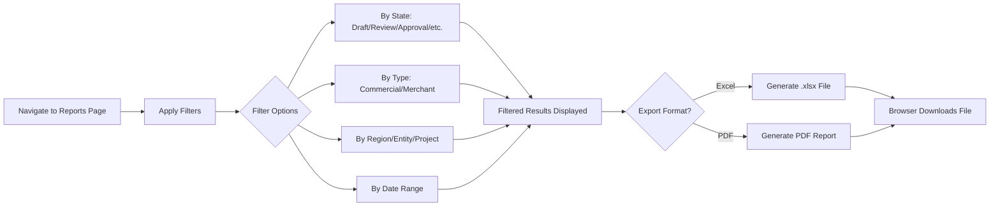

# 8. Reports & Analytics

## Overview

CCRS provides three dedicated reporting surfaces -- the **Reports Page** for tabular contract data with export capabilities, the **Analytics Dashboard** for visual insights via interactive widgets, and the **AI Cost Report** for monitoring AI analysis spending. In addition, every user sees summary widgets on the **Main Dashboard** upon login.

---

## Reports Page

**Access**: Finance, Legal, Audit, System Admin

The Reports Page presents a filterable, sortable table of all contracts in the system. Use it to locate specific contracts, review portfolio composition, and generate exports for external stakeholders.

### Navigating to Reports

1. Open the **Reports** navigation group in the left sidebar.
2. Click **Reports**.

### Table Columns

The reports table displays the following columns for each contract:

| Column | Description |
|---|---|
| **Title** | The contract name (searchable) |
| **Type** | Contract type displayed as a badge (e.g., Commercial, Merchant) |
| **Counterparty** | The legal name of the counterparty (searchable) |
| **Region** | The geographic region the contract belongs to |
| **Entity** | The legal entity entering into the agreement |
| **State** | Current workflow state shown as a colour-coded badge |
| **Expiry** | Contract expiry date (sortable) |
| **Created** | Date the contract was created (sortable) |

Click any sortable column header to reorder results. The table defaults to most recently created contracts first.

### Filtering

Filters appear above the table and update results in real time as you change them. You do not need to click a "search" button -- the table refreshes automatically.

| Filter | Options |
|---|---|
| **State** | Draft, Review, Approval, Signing, Countersign, Executed, Archived |
| **Type** | Dynamically populated from contract types in the database |
| **Region** | All configured regions |
| **Entity** | All configured entities |

Multiple filters can be combined. For example, selecting State = "Executed" and Region = "EMEA" shows only executed contracts in the EMEA region.

To clear all filters, click the reset icon next to the filter bar.

### Pagination

The table supports configurable page sizes of 10, 25, 50, or 100 rows. Use the dropdown at the bottom of the table to adjust how many contracts are displayed per page.

---

## Exporting Data

Two export options are available from the Reports Page header. Both export buttons respect whatever filters are currently applied -- only the contracts visible in the filtered results are included in the export file.

### Report Export Flow

### Export to Excel

Click the green **Export Excel** button in the page header. CCRS generates a comprehensive `.xlsx` spreadsheet containing all filtered contracts with their full details. The file opens in a new browser tab and downloads automatically.

**Use cases**:
- Importing contract data into financial models or ERP systems.
- Building pivot tables for ad-hoc analysis.
- Sharing raw data with colleagues who need to perform their own calculations.

### Export to PDF

Click the red **Export PDF** button in the page header. CCRS generates a formatted PDF report suitable for printing or attaching to emails and board packs. The file opens in a new browser tab and downloads automatically.

**Use cases**:
- Producing a snapshot report for management review.
- Attaching a portfolio summary to compliance submissions.
- Printing a hard copy for physical filing or meeting handouts.

---

## Analytics Dashboard

**Access**: System Admin, Legal, Finance, Audit (requires the **advanced_analytics** feature flag to be enabled)

The Analytics Dashboard is a visual reporting surface designed for executive-level insight into the contract portfolio. It is accessed via the **Analytics Dashboard** item in the Reports navigation group.

### Widgets

The dashboard displays six interactive widgets arranged in a two-column layout:

#### Contract Pipeline Funnel

A visual funnel chart showing how many contracts are at each lifecycle stage (Draft, Review, Approval, Signing, Countersign, Executed, Archived). The funnel shape makes it easy to spot bottlenecks -- if contracts are accumulating at the Approval stage, for example, additional approvers may be needed.

#### Risk Distribution

A breakdown of contracts by AI-assessed risk level: **Low**, **Medium**, **High**, and **Critical**. This widget provides a quick health check on the overall portfolio risk profile. Contracts are categorised based on results from the AI risk analysis feature.

#### Compliance Overview

A summary of regulatory compliance status across the contract portfolio. Shows the proportion of contracts that are compliant, non-compliant, or pending compliance review against mapped regulatory frameworks. This widget is especially relevant for Legal and Audit teams monitoring regulatory exposure.

#### Obligation Tracker

Displays upcoming contractual obligations and deadlines with priority indicators. Obligations are extracted from contracts (either manually entered or identified by AI analysis) and sorted by urgency. This helps ensure that deliverables, payment milestones, and renewal decisions are actioned on time.

#### AI Usage & Cost

A spending overview for AI-powered contract analysis. Shows total cost, number of analyses, and cost trends over time. Useful for Finance teams monitoring AI feature budgets.

#### Workflow Performance

Metrics on average time spent at each workflow stage, helping identify where the approval process slows down. If contracts routinely spend weeks in the Approval stage but only days in Review, this widget highlights the imbalance so process owners can investigate.

---

## Main Dashboard Widgets

**Access**: All roles (visible on the home dashboard after login)

The main Dashboard is the first screen every user sees. It provides a summary of the most important metrics through six core widgets (with a seventh appearing when the regulatory compliance feature is enabled).

### Contract Status

A chart showing the distribution of contracts across workflow states. At a glance, you can see how many contracts are in Draft, Review, Approval, Signing, Countersign, Executed, and Archived states.

### Expiry Horizon

Lists contracts expiring within the next **30**, **60**, and **90 days**. This widget ensures that upcoming expirations are visible well in advance, giving Commercial and Operations teams time to initiate renewals or renegotiations.

### Pending Workflows

Shows your personal action items -- contracts that are waiting for your review, approval, or signature. Each item links directly to the relevant contract so you can take action immediately.

### Active Escalations

Highlights overdue workflow stages that need management attention. When a contract has been sitting in a workflow stage past its expected completion time, it appears here as an escalation.

### AI Cost

A summary card showing total AI analysis spending -- the number of analyses run and the cumulative cost in USD. This gives a quick pulse on AI feature usage without navigating to the full AI Cost Report.

### Obligation Tracker

Surfaces upcoming obligations and deadlines from across the contract portfolio. Functions identically to the Analytics Dashboard version but is included on the main Dashboard for broader visibility.

### Compliance Overview (conditional)

Appears only when the **regulatory_compliance** feature flag is enabled. Shows the same compliance status summary as the Analytics Dashboard widget.

---

## AI Cost Report

**Access**: Finance, System Admin

The AI Cost Report provides a detailed, line-item breakdown of every AI analysis performed in CCRS. It is accessed via the **AI Cost Analytics** item in the Reports navigation group.

### What It Tracks

Each row in the report represents a single AI analysis run and includes the following data:

| Column | Description |
|---|---|
| **Contract** | The contract that was analysed (searchable) |
| **Analysis Type** | The type of analysis performed (Summary, Extraction, Risk, Template Deviation, Obligations) |
| **Model** | The AI model used for the analysis |
| **Input Tokens** | Number of tokens sent to the AI model |
| **Output Tokens** | Number of tokens received from the AI model |
| **Cost (USD)** | Dollar cost of the analysis |
| **Time (ms)** | Processing time in milliseconds |
| **Status** | Completion status (Completed, Failed, Processing, Pending) |
| **When** | Relative timestamp (e.g., "2 hours ago") |

### Filters

| Filter | Options |
|---|---|
| **Analysis Type** | Summary, Extraction, Risk Analysis, Template Deviation, Obligations |
| **Status** | Completed, Failed, Processing, Pending |

### Summary Statistics

The page header displays four aggregate metrics calculated from all completed analyses:

- **Total Cost** -- cumulative USD spend across all analyses.
- **Total Tokens** -- combined input and output tokens consumed.
- **Total Analyses** -- number of completed analysis runs.
- **Average Cost** -- mean USD cost per analysis.

These figures help Finance teams budget for AI features and identify whether usage is trending up or down.

---

## Who Can Access What

The table below summarises reporting and analytics access by role.

| Report / Feature | System Admin | Legal | Commercial | Finance | Operations | Audit |
|---|---|---|---|---|---|---|
| Reports Page | Yes | Yes | -- | Yes | -- | Yes |
| Export Excel / PDF | Yes | Yes | -- | Yes | -- | Yes |
| Analytics Dashboard | Yes | Yes | -- | Yes | -- | Yes |
| AI Cost Report | Yes | -- | -- | Yes | -- | -- |
| Main Dashboard | Yes | Yes | Yes | Yes | Yes | Yes |

**Notes**:
- The Analytics Dashboard requires the **advanced_analytics** feature flag to be enabled. When disabled, the navigation item is hidden and the page is inaccessible regardless of role.
- Export buttons on the Reports Page are available to every role that can access the Reports Page.
- The Main Dashboard is visible to all authenticated users and adapts its content based on the user's role and permissions.

---

## Tips

- **Narrow before exporting** -- Apply filters to limit results to the contracts relevant to your report. Exporting the entire portfolio into Excel produces a large file; filtering first keeps exports focused and manageable.
- **Bookmark filtered views** -- Filters are encoded in the URL. Bookmark a filtered Reports Page to return to the same view without re-applying filters.
- **Use the Analytics Dashboard for presentations** -- The visual widgets are designed for executive summaries. Screenshot them or share the page URL with stakeholders who have the appropriate role.
- **Monitor AI costs regularly** -- If your organisation runs AI analysis on every contract, costs can accumulate. Use the AI Cost Report to establish a baseline and track month-over-month trends.
