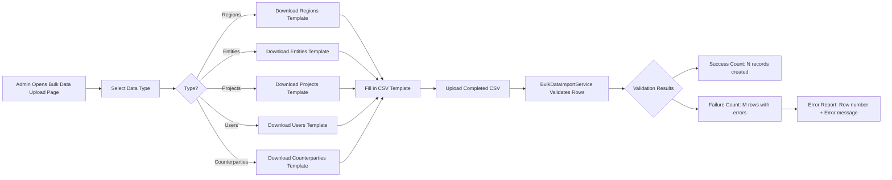
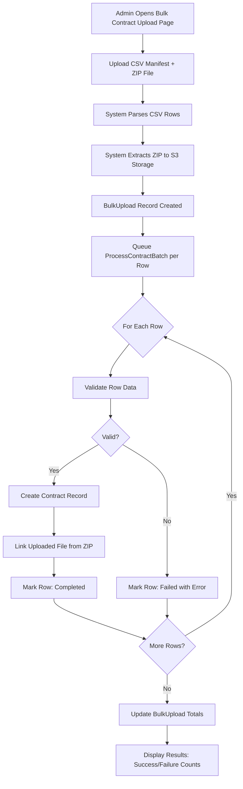

# 9. Bulk Operations

## Overview

System Admins can bulk-import data and contracts via CSV files. This is useful for initial system setup, migrating data from other systems, or batch-processing large numbers of records.

Both bulk operations are restricted to users with the **system_admin** role. They are found under the **Administration** section of the main navigation.

---

## Bulk Data Upload

**Location:** Administration > Bulk Data Upload

The Bulk Data Upload page lets you import reference data into CCRS in batches. Instead of creating records one at a time through the UI, you can prepare a CSV file and upload hundreds of records at once.

### Supported Data Types

| Data Type | Key Columns | Notes |
|---|---|---|
| **Regions** | `name`, `code` | Geographic groupings. Must be created before Entities. |
| **Entities** | `name`, `code`, `region_code` | Legal entities within a Region. Must be created before Projects. |
| **Projects** | `name`, `code`, `entity_code` | Business projects within an Entity. |
| **Users** | `name`, `email`, `role` | User accounts provisioned in the system. |
| **Counterparties** | `legal_name`, `registration_number`, `jurisdiction` | External parties to contracts. |

### Step-by-Step Instructions

1. **Select the data type** from the dropdown at the top of the page.
2. **Click "Download Template"** to get a CSV file with the correct column headers for that data type.
3. **Fill in the template** with your data. Each row represents one record. Do not modify the header row.
4. **Upload the completed CSV file** using the file upload field.
5. The system validates each row and processes all valid ones.
6. **Review the results:** the page displays the success count, the failure count, and detailed error messages for any rows that failed.

### Import Order and Dependencies

You must create parent records before child records that reference them:

1. **Regions first** -- these have no dependencies.
2. **Entities second** -- each Entity references a Region via the `region_code` column.
3. **Projects third** -- each Project references an Entity via the `entity_code` column.

Users and Counterparties have no ordering dependencies and can be imported at any time.

### Important Notes

- The `region_code` and `entity_code` columns expect the **code** value (e.g., `EMEA`, `DTL-UK`), not the name and not the database ID.
- Duplicate checking is performed automatically. If a record with the same code already exists, that row is skipped rather than creating a duplicate.
- The CSV file must be UTF-8 encoded. If you prepare it in Excel, use "Save As > CSV UTF-8" to avoid character encoding issues.

### Bulk Data Import Flow

The following diagram shows the end-to-end process for importing reference data:

---

## Bulk Contract Upload

**Location:** Administration > Bulk Contract Upload

The Bulk Contract Upload page is designed for importing many contracts at once, each with an associated document file. You provide a CSV manifest that describes the contracts and a ZIP archive containing the actual files.

### Preparation

Before uploading, you need to prepare two files:

**1. CSV Manifest**

Create a CSV file with the following columns:

| Column | Description | Example |
|---|---|---|
| `title` | Contract title | "Service Agreement - Acme Corp" |
| `contract_type` | Type of contract | "service_agreement" |
| `region_code` | Code of the Region | "EMEA" |
| `entity_code` | Code of the Entity | "DTL-UK" |
| `project_code` | Code of the Project | "PROJ-001" |
| `counterparty_registration` | Registration number of the counterparty | "12345678" |
| `filename` | Name of the file in the ZIP archive | "acme-service-agreement.pdf" |
| `start_date` | Contract start date (YYYY-MM-DD) | "2026-03-01" |
| `end_date` | Contract end date (YYYY-MM-DD) | "2027-02-28" |
| `value` | Contract monetary value | "50000.00" |
| `currency` | Currency code | "GBP" |

**2. ZIP Archive**

Create a ZIP file containing all the contract documents (PDF or DOCX). The filename of each document must match exactly what appears in the `filename` column of the CSV manifest. Filenames are case-sensitive.

### Upload Limits

- **Maximum 500 files** per upload.
- **Maximum 50 MB** per individual file within the ZIP.

### Upload Process

1. Navigate to the **Bulk Contract Upload** page under Administration.
2. Upload the **CSV manifest** file.
3. Upload the **ZIP file** containing the contract documents.
4. Click **"Process Upload"** to begin.
5. The system validates the manifest, extracts files from the ZIP, and creates contract records.
6. A progress display shows real-time status as each row moves from pending to processing to completed or failed.
7. Review the results: each row shows its individual status and any error messages.

### Bulk Contract Upload Processing Flow

The following diagram shows how the system processes a bulk contract upload:

---

## Monitoring Progress

Bulk uploads are processed **asynchronously** via background jobs. You do not need to keep the page open for processing to continue, but the page provides real-time feedback if you stay on it.

### Status Tracking

Each bulk upload has an overall status:

| Status | Meaning |
|---|---|
| **Pending** | Upload received, waiting for processing to begin. |
| **Processing** | Background jobs are actively working through the rows. |
| **Completed** | All rows have been processed (some may have failed individually). |
| **Failed** | The upload itself failed (e.g., invalid CSV format, corrupt ZIP). |

Each individual row within the upload is also tracked with its own status (pending, processing, completed, or failed).

### Summary Totals

The upload detail view shows:

- **Total Rows** -- the number of data rows in the CSV.
- **Successful** -- the number of rows that were processed and created records.
- **Failed** -- the number of rows that encountered errors.

### Error Logs

For failed rows, the system records a detailed error log in JSON format. This log includes the row number, the data that was submitted, and the specific validation or processing error that occurred. You can review this information directly on the upload detail page.

---

## Troubleshooting Common Errors

| Error | Cause | Fix |
|---|---|---|
| "Region code not found" | The `region_code` value in the CSV does not match any existing Region. | Verify region codes against the Regions list. Import Regions first if needed. |
| "Entity code not found" | The `entity_code` value in the CSV does not match any existing Entity. | Verify entity codes against the Entities list. Import Entities first if needed. |
| "File not found in ZIP" | The `filename` in the CSV does not match any file in the ZIP archive. | Check that filenames match exactly, including case and file extension. |
| "Duplicate record" | A record with the same code or unique identifier already exists. | Remove the duplicate row from the CSV, or update the existing record manually. |
| "Invalid file format" | A file in the ZIP is not a PDF or DOCX. | Replace the file with a PDF or DOCX version. Only these formats are accepted. |
| "File exceeds size limit" | An individual file in the ZIP is larger than 50 MB. | Compress or split the file to bring it under the 50 MB limit. |
| "Too many files" | The CSV manifest contains more than 500 rows. | Split the upload into multiple batches of 500 or fewer. |

---

## Best Practices

- **Start with a small test batch.** Upload 5-10 records first to confirm your CSV format is correct before processing a large file.
- **Follow the dependency order.** Always import Regions before Entities, and Entities before Projects. Contracts depend on all three plus Counterparties.
- **Use the downloaded templates.** The templates include the exact column headers the system expects. Adding, removing, or renaming columns will cause validation failures.
- **Check codes, not names.** The CSV columns `region_code`, `entity_code`, and `project_code` require the short code value, not the human-readable name.
- **Verify ZIP contents.** Before uploading, open the ZIP and confirm that every filename listed in your CSV manifest is present and spelled correctly.
- **Review error reports promptly.** After a bulk upload completes, check the error log for any failed rows. Fix and re-upload only the failed rows in a new CSV rather than re-uploading the entire batch.
