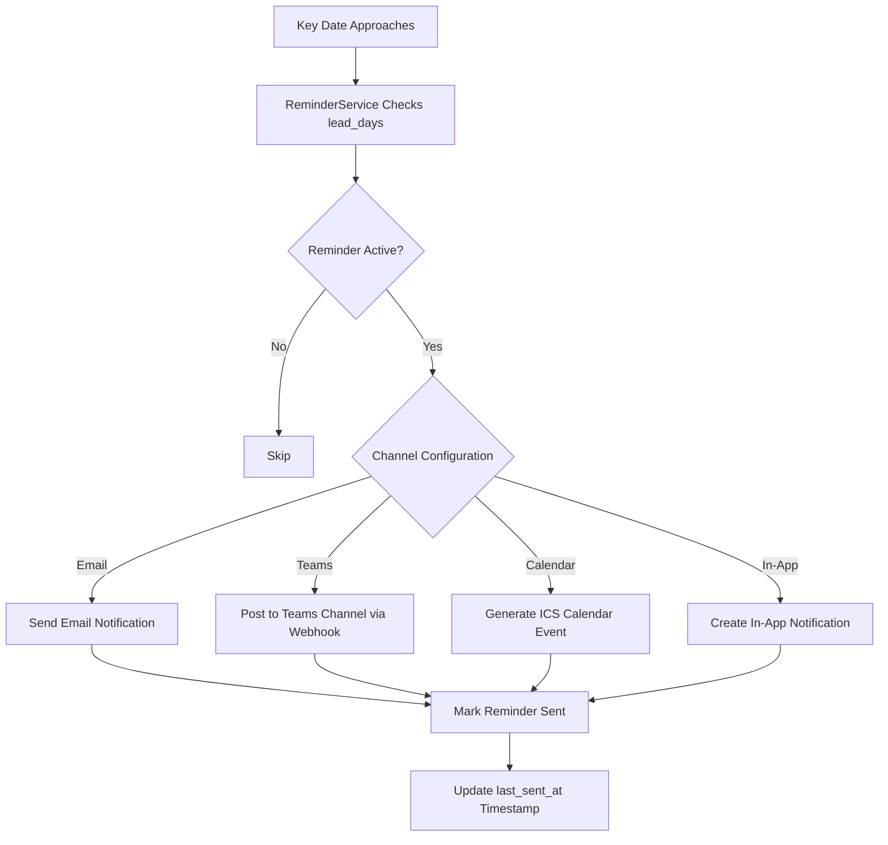

# 10. Notifications & Reminders

CCRS keeps you informed about contract activity through a multi-channel notification system. You can receive alerts via email, Microsoft Teams, the in-app notifications panel, or as downloadable calendar events -- and you control exactly which channels each notification category uses.

---

## Notification Channels

CCRS supports four notification channels. Each serves a different workflow need.

| Channel | How It Works | Best For |
|---|---|---|
| **Email** | Standard email notifications sent to the address registered on your account. | Formal alerts you need a paper trail for -- approvals, escalations, signing events. |
| **Microsoft Teams** | Posts to a configured Teams channel via webhook integration. | Keeping your team informed of contract activity in real time without leaving Teams. |
| **In-App** | Notifications appear in the **bell icon** in the top-right corner of every CCRS page. A badge shows the count of unread items. | Quick, low-friction alerts while you are already working inside CCRS. |
| **Calendar (ICS)** | Generates a downloadable `.ics` calendar file for date-based notifications. The file can be imported into Outlook, Google Calendar, Apple Calendar, or any standards-compliant calendar application. | Key date reminders -- contract expiry, renewal deadlines, payment milestones. |

---

## Notification Preferences

You can control exactly which types of notifications you receive and on which channels.

### Accessing Preferences

1. Click your **name or avatar** in the top-right corner of the page.
2. Select **Notification Preferences** from the profile menu.

### Configuring Preferences

The Notification Preferences page displays a grid of **notification categories** along the left and **channels** across the top. Toggle each combination on or off to match your workflow.

Available categories include:

- **Workflow Actions** -- stage assignments, approval requests, rejections.
- **Contract Updates** -- status changes, field edits, document uploads.
- **Signing Events** -- signing session creation, signature completion, countersigning requests.
- **Escalations** -- SLA breaches and tiered escalation alerts.
- **Reminders** -- key date reminders (expiry, renewal, payment, custom dates).

For example, you might enable email and Teams for **Escalations** (so you never miss a time-critical alert) but limit **Contract Updates** to in-app only (to avoid inbox clutter).

---

## The Notifications Inbox

The in-app notifications inbox is your central hub for all CCRS notifications regardless of which other channels are enabled.

### Viewing Notifications

1. Click the **bell icon** in the top-right corner of any page.
2. A dropdown panel shows your most recent notifications, newest first.
3. Click a notification to navigate directly to the relevant record (contract, workflow stage, signing session, etc.).

### Marking as Read

- Clicking a notification marks it as **read** automatically.
- You can also mark individual notifications or **all notifications** as read from the panel.

### Notification Data

Each notification contains:

| Field | Description |
|---|---|
| **Type** | The category of the notification (workflow, signing, escalation, etc.). |
| **Title** | A brief summary of the event. |
| **Message** | A more detailed description of what happened and what action (if any) is required. |
| **Channel** | Which channel delivered this notification (email, Teams, in-app, calendar). |
| **Timestamp** | When the notification was created. |
| **Read Status** | Whether you have viewed the notification. |

---

## Key Dates

Key Dates are specific milestones associated with a contract -- expiry dates, renewal windows, payment due dates, compliance review dates, and any custom dates your organisation tracks.

### Viewing Key Dates

1. Navigate to **Key Dates** in the left sidebar.
2. The Key Dates page shows a consolidated list of upcoming milestones across **all contracts** you have access to.

### Key Date Fields

| Field | Description |
|---|---|
| **Contract** | The contract this date belongs to. Click to open the contract record. |
| **Date Type** | The category of the date -- e.g. Expiry, Renewal, Payment, Custom. |
| **Date Value** | The actual date. |
| **Description** | Additional context about the milestone. |

### Filtering

Use the filters at the top of the page to narrow the list by:

- **Date range** -- show only dates within a specific window.
- **Contract** -- focus on a single contract's milestones.
- **Date type** -- show only expiry dates, only payment dates, etc.

Key dates link directly to their associated contract, so you can navigate to the full contract record in a single click.

---

## Reminders

Reminders are the mechanism that turns Key Dates into proactive notifications. Instead of checking the Key Dates page manually, you configure reminders to alert you automatically as a date approaches.

### How Reminders Work

Each reminder is linked to a specific **Contract Key Date** and defines:

- **Lead Days** -- how many days before the key date the reminder should fire. For example, a lead of 30 days on a contract expiry date means you are notified one month before the contract expires.
- **Channel** -- which notification channel the reminder uses (email, Teams, in-app, or calendar).
- **Active / Inactive** -- a toggle to enable or disable the reminder without deleting it.

When the current date falls within the lead-day window, CCRS automatically dispatches the reminder through the configured channel and records the send timestamp.

### Creating a Reminder

1. Navigate to **Reminders** in the left sidebar.
2. Click **"New Reminder"**.
3. Select the **Contract** and **Key Date** the reminder applies to.
4. Set the **Lead Days** value (e.g. 7, 14, 30, 60, 90).
5. Choose the **Channel** for delivery.
6. Ensure the **Active** toggle is on.
7. Click **Save**.

### Managing Reminders

The Reminders page lists all configured reminders with their current status.

| Column | Description |
|---|---|
| **Contract** | The associated contract. |
| **Key Date** | The milestone this reminder tracks. |
| **Lead Days** | Days before the date when the reminder fires. |
| **Channel** | Delivery channel (email, Teams, in-app, calendar). |
| **Active** | Whether the reminder is currently enabled. |
| **Last Sent At** | Timestamp of the most recent dispatch -- useful for confirming the reminder is working. |

You can edit, deactivate, or delete reminders at any time.

---

## Reminder and Notification Dispatch Flow

The diagram below shows how CCRS processes reminders and dispatches notifications as key dates approach.

### Flow Explanation

1. **Key Date Approaches** -- the system periodically checks all active reminders against the current date.
2. **Lead Days Check** -- for each reminder, CCRS calculates whether the current date falls within the lead-day window before the key date.
3. **Active Check** -- inactive reminders are skipped entirely.
4. **Channel Dispatch** -- the notification is sent through the channel configured on the reminder (email, Teams, calendar ICS, or in-app).
5. **Mark Sent** -- the reminder's `last_sent_at` timestamp is updated to prevent duplicate sends.

---

## Escalation Notifications

Escalation notifications are a special category that is triggered automatically by the workflow engine -- you do not configure these manually.

### When Escalations Occur

An escalation is generated when a workflow stage's **SLA is breached** -- that is, the assigned approver has not taken action within the allotted time. Escalations follow the **tiered system** defined in the workflow template (see [Chapter 6 -- Workflow Templates](06-workflow-templates.md) for details on configuring tiers).

### How Escalation Notifications Are Delivered

- Escalation notifications follow the same multi-channel system as all other notifications.
- They are delivered to the channels you have enabled for the **Escalations** category in your Notification Preferences.
- Escalation events also appear on the **Escalations** page (accessible from the left sidebar), where they are displayed with **priority indicators** so you can triage by urgency.

### Escalation Priority Levels

| Priority | Meaning |
|---|---|
| **Tier 1** | Initial escalation -- the original approver has missed the SLA. Additional stakeholders are notified. |
| **Tier 2** | Continued inaction -- senior management is brought into the loop. |
| **Tier 3** | Executive escalation -- the highest escalation tier, typically involving department heads or executive leadership. |

Each tier adds progressively more senior recipients to ensure that no contract action is left unattended indefinitely.

---

## Microsoft Teams Integration

CCRS integrates with Microsoft Teams via **incoming webhooks**. When Teams is enabled as a notification channel, CCRS posts formatted messages to the configured Teams channel.

### What Teams Notifications Look Like

Teams notifications include:

- A **title** summarising the event.
- A **message body** with relevant details (contract title, reference number, key date, etc.).
- A **link** back to the relevant record in CCRS for one-click navigation.

### Configuration

Teams webhook URLs are configured by your **System Administrator** at the organisation level. If you need Teams notifications but are not receiving them, verify that:

1. Teams is enabled in your **Notification Preferences** for the relevant categories.
2. The Teams webhook has been configured by your System Administrator.

---

## Calendar (ICS) Integration

For date-driven notifications -- particularly key date reminders -- CCRS can generate **ICS calendar files** that you download and import into your preferred calendar application.

### Supported Calendar Applications

Any application that supports the iCalendar (.ics) standard, including:

- Microsoft Outlook
- Google Calendar
- Apple Calendar
- Thunderbird

### How It Works

When a reminder or notification is dispatched via the **Calendar** channel:

1. CCRS generates an `.ics` file containing the event details (date, title, description, contract reference).
2. The file is made available for download.
3. Import the file into your calendar application to create a calendar event with the appropriate date and details.

This is especially useful for tracking contract expiry dates, renewal windows, and payment milestones alongside your regular schedule.

---

## Best Practices

- **Enable at least two channels for critical categories.** For escalations and signing events, consider enabling both email and Teams (or email and in-app) so that you have a backup if one channel is missed.
- **Use calendar ICS for key dates.** Importing expiry and renewal dates into your calendar ensures they appear alongside your meetings and other commitments.
- **Set multiple reminders with staggered lead days.** For high-value contracts, create reminders at 90, 60, 30, and 7 days before expiry to give yourself escalating urgency.
- **Review your preferences periodically.** As your role or responsibilities change, revisit Notification Preferences to ensure you are still receiving the right alerts on the right channels.
- **Check the Notifications inbox regularly.** Even if you rely primarily on email or Teams, the in-app inbox serves as a single source of truth for all notifications.
