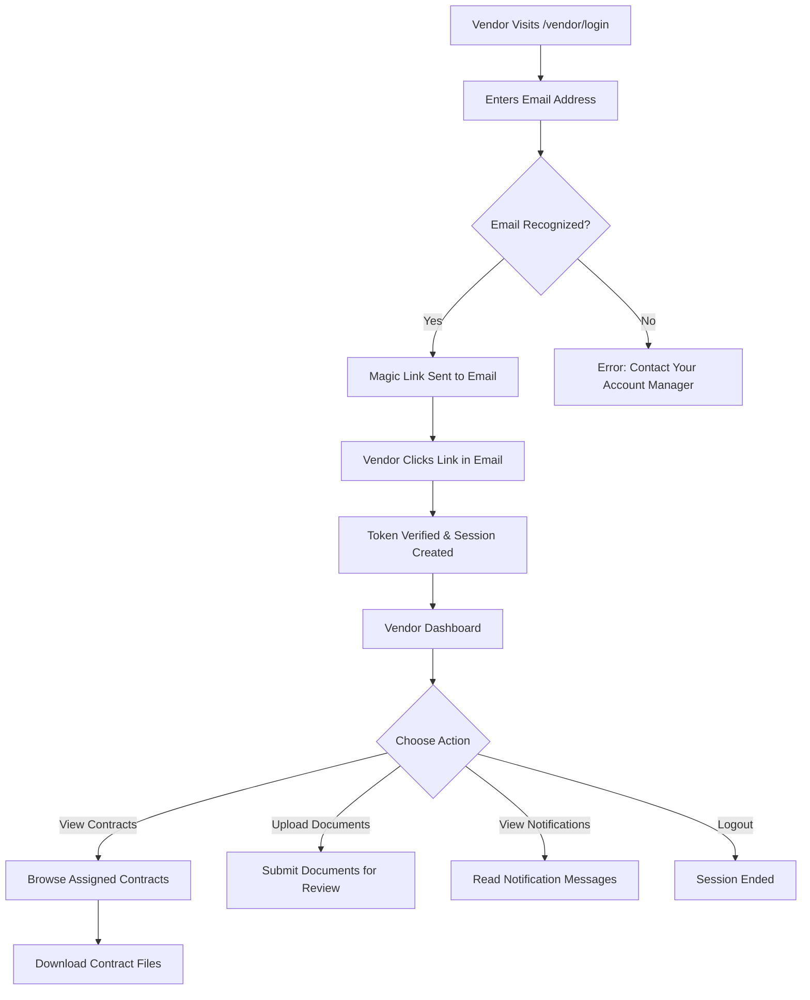

# 12. Vendor Portal

## What is the Vendor Portal?

The Vendor Portal is an external-facing interface for counterparty contacts -- vendors, suppliers, and partners who need to interact with CCRS without having a full internal account. It provides a simplified, secure way to view contracts assigned to your organisation, upload documents when requested, and receive notifications from CCRS users.

The portal uses magic-link authentication, meaning there are no passwords to remember. Access is controlled entirely through verified email addresses linked to a counterparty record in CCRS.

---

## Accessing the Vendor Portal

Your account manager will provide you with the vendor portal URL. The login process works as follows:

1. Visit the vendor portal login page at `/vendor/login`.
2. Enter your registered email address and click **Send Login Link**.
3. If your email is recognised, a magic link is sent to your inbox. The link is valid for **24 hours**.
4. Open the email and click the link to access the portal. A secure session is created automatically.
5. If your email is not recognised, you will see an error message. Contact your account manager to be added to the system.

No password is required at any point. The magic link is your secure credential.

---

## Vendor Dashboard

After logging in, you arrive at the vendor dashboard. The dashboard provides an overview of your activity and quick access to the three main areas of the portal.

### Your Contracts

A list of contracts associated with your counterparty organisation. Each entry shows the contract title, type, current status, and key dates (start date, end date, renewal date). Click any contract to view its details and download the contract file (PDF or DOCX).

### Documents

A list of documents you have uploaded through the portal, along with their status. This section shows the document title, the contract it is associated with, and the upload date.

### Notifications

Messages sent to you by CCRS users regarding your contracts. Each notification includes a title and message body. Unread notifications are highlighted. Click a notification to mark it as read.

---

## Viewing Contracts

From the dashboard, click **Your Contracts** to browse all contracts assigned to your counterparty.

- **Browse** -- contracts are listed with their title, type, status, and key dates.
- **View details** -- click a contract to see its full details, including contract terms, parties, and timeline.
- **Download files** -- download the contract document in PDF or DOCX format directly from the contract detail page.

You can only see contracts that are associated with your counterparty. Contracts belonging to other organisations are not visible.

---

## Uploading Documents

CCRS users may request that you upload documents -- for example, compliance certificates, insurance documentation, or signed counterparts. To upload a document:

1. Navigate to the contract that requires the document, or click **Upload Document** from the documents section.
2. Click **Upload Document**.
3. Select the file from your device. Accepted formats are PDF and DOCX.
4. Enter a descriptive **document title** (e.g., "Certificate of Insurance 2026").
5. Click **Submit**.

After submission:

- The document is stored securely and associated with the relevant contract.
- CCRS users who manage that contract are notified of the new upload.
- The document appears in your **Documents** list with its upload date.

---

## Notifications

CCRS users can send notifications to vendor portal users. Common notification scenarios include:

- A new contract has been assigned to your counterparty.
- A document upload has been requested.
- A contract status has changed (e.g., approved, renewed, or terminated).
- A reminder about an upcoming deadline.

Notifications appear on the dashboard and in the dedicated **Notifications** section. Unread notifications are highlighted. Click a notification to view the full message and mark it as read.

---

## Security

The vendor portal is designed with multiple layers of security to protect your data and your organisation's contracts.

### Magic Link Authentication

- No passwords are stored or transmitted. Authentication is handled entirely through single-use magic links.
- Tokens are generated using a **cryptographically secure pseudo-random number generator (CSPRNG)**.
- Only the **SHA-256 hash** of each token is stored in the database. The plaintext token appears only in the email link. Even if the database were compromised, tokens could not be extracted.
- Tokens expire after **24 hours**. After expiry, you must request a new login link.

### Session Security

- All sessions are time-limited. You will be logged out automatically after the session expires.
- Logging out invalidates the session immediately.

### Data Isolation

- You can only access contracts associated with your counterparty. Contracts belonging to other organisations are not visible.
- Uploaded documents are stored securely in S3-compatible object storage and are not publicly accessible.

---

## For CCRS Administrators

This section is for internal CCRS users who manage vendor portal access.

### Managing Vendor Users

Navigate to **Administration --> Vendor Users** to manage vendor portal accounts.

| Action | How |
|---|---|
| **Create a vendor user** | Click **New Vendor User**. Enter the user's name, email address, and select the linked counterparty. |
| **Edit a vendor user** | Click the vendor user's name to edit their details (name, email, counterparty). |
| **Activate / deactivate** | Toggle the **Active** switch to enable or disable portal access. Deactivated users cannot log in. |
| **View vendor users by counterparty** | Filter the vendor user list by counterparty to see all portal users for a specific organisation. |

### Vendor User Fields

| Field | Description |
|---|---|
| **Name** | The vendor contact's full name. |
| **Email** | The email address used for magic link login. Must be unique across all vendor users. |
| **Counterparty** | The counterparty organisation this vendor user belongs to. Determines which contracts they can see. |
| **Phone** | Optional contact phone number. |
| **Active** | Whether the user can log in to the vendor portal. |

### Sending Notifications to Vendors

CCRS users can send notifications to vendor portal users through the VendorNotificationService. Notifications are delivered to the vendor's portal dashboard -- they appear the next time the vendor logs in or refreshes their dashboard.

### Best Practices

- **One counterparty per vendor user** -- each vendor user is linked to exactly one counterparty. If a contact works across multiple counterparties, create separate vendor user accounts for each.
- **Deactivate rather than delete** -- when a vendor contact leaves their organisation, deactivate their account rather than deleting it. This preserves the audit trail of their document uploads and portal activity.
- **Review active vendor users periodically** -- ensure that only current contacts have active portal access.
