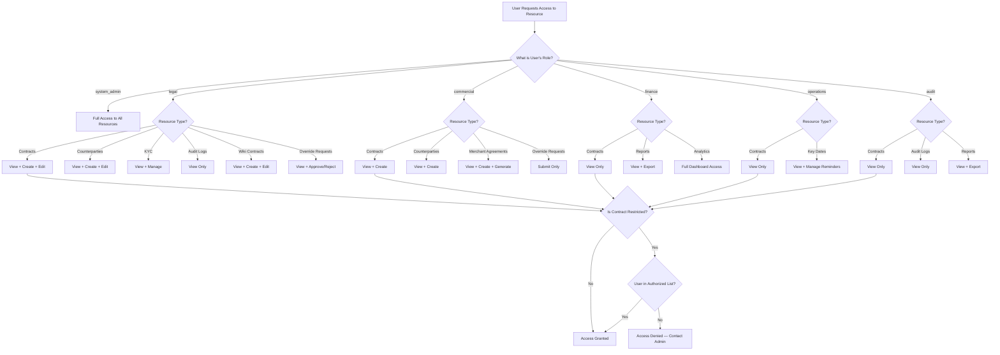

# 14. Role Reference Matrix

CCRS uses role-based access control (RBAC) powered by Spatie Permissions to govern what every user can see and do across the platform. Each user is assigned exactly one of six roles, and that role determines the full set of permissions available to them. This chapter provides a comprehensive reference for every role-permission combination, explains how restricted contracts and signing authorities add secondary access checks, and includes a visual decision tree to help you understand how the system evaluates access requests.

---

## The Six Roles

CCRS defines six roles. Each serves a distinct function within the contract lifecycle.

| Role | Purpose |
|---|---|
| **System Admin** | Full platform access. Manages users, organisation structure, workflow templates, signing authorities, bulk operations, and all configuration. Receives wildcard (`*`) permissions. |
| **Legal** | Primary contract lifecycle role. Creates, edits, and manages contracts, counterparties, KYC templates, and wiki contracts. Views audit logs and approves override requests. Accesses escalation and compliance features. |
| **Commercial** | Focuses on contract origination and merchant agreements. Creates contracts and counterparties, generates merchant agreements, and submits override requests for legal review. |
| **Finance** | Read-only access to contracts with full access to financial reporting, the analytics dashboard, and the AI cost report. |
| **Operations** | Read-only access to contracts with day-to-day operational tools: key date tracking and reminder management. |
| **Audit** | Read-only access to contracts and audit logs for independent review. Can view and export reports. |

---

## Full Permissions Grid

The table below lists every major feature and action in CCRS and shows which roles have access. "Yes" indicates the role can perform the action; a dash (-) indicates the action is not available to that role.

| Feature / Action | System Admin | Legal | Commercial | Finance | Operations | Audit |
|---|---|---|---|---|---|---|
| **Contracts** | | | | | | |
| View Contracts | Yes | Yes | Yes | Yes | Yes | Yes |
| Create Contracts | Yes | Yes | Yes | - | - | - |
| Edit Contracts | Yes | Yes | - | - | - | - |
| Delete Contracts | Yes | - | - | - | - | - |
| Restrict / Unrestrict Contracts | Yes | Yes | - | - | - | - |
| **Counterparties** | | | | | | |
| View Counterparties | Yes | Yes | Yes | - | - | - |
| Create Counterparties | Yes | Yes | Yes | - | - | - |
| Edit Counterparties | Yes | Yes | - | - | - | - |
| Merge Counterparties | Yes | - | - | - | - | - |
| **Override Requests** | | | | | | |
| Submit Override Requests | - | - | Yes | - | - | - |
| Approve / Reject Overrides | Yes | Yes | - | - | - | - |
| **Organisation & Configuration** | | | | | | |
| Manage Workflow Templates | Yes | - | - | - | - | - |
| Manage Org Structure | Yes | - | - | - | - | - |
| Manage KYC Templates | Yes | Yes | - | - | - | - |
| Manage Signing Authorities | Yes | - | - | - | - | - |
| Manage Vendor Users | Yes | - | - | - | - | - |
| **Bulk Operations** | | | | | | |
| Bulk Data Upload | Yes | - | - | - | - | - |
| Bulk Contract Upload | Yes | - | - | - | - | - |
| **Audit & Compliance** | | | | | | |
| View Audit Logs | Yes | Yes | - | - | - | Yes |
| View Reports | Yes | Yes | - | Yes | - | Yes |
| Export Reports | Yes | Yes | - | Yes | - | Yes |
| Analytics Dashboard | Yes | - | - | Yes | - | - |
| AI Cost Report | Yes | - | - | Yes | - | - |
| **AI & Analysis** | | | | | | |
| Trigger AI Analysis | Yes | Yes | - | - | - | - |
| Start Redline Review | Yes | Yes | - | - | - | - |
| **Wiki Contracts** | | | | | | |
| Manage Wiki Contracts | Yes | Yes | - | - | - | - |
| **Signing** | | | | | | |
| Send for Signing | Yes | Yes | Yes | - | - | - |
| **Escalations & Dates** | | | | | | |
| View Escalations | Yes | Yes | - | - | - | - |
| View Key Dates | Yes | Yes | Yes | - | Yes | - |
| Manage Reminders | Yes | Yes | Yes | - | Yes | - |
| **Merchant Agreements** | | | | | | |
| View Merchant Agreements | Yes | Yes | Yes | - | - | - |
| Generate Merchant Agreements | Yes | Yes | Yes | - | - | - |
| **Personal** | | | | | | |
| Notification Preferences | Yes | Yes | Yes | Yes | Yes | Yes |
| My Signatures | Yes | Yes | Yes | Yes | Yes | Yes |
| Help & Guide | Yes | Yes | Yes | Yes | Yes | Yes |

---

## Role-Based Access Decision Tree

The following diagram illustrates how CCRS evaluates whether a user can access a given resource. The system first checks the user's role, then the resource type, and finally whether the contract is restricted.

### How to Read the Decision Tree

1. **Role check** -- CCRS first identifies the user's role. System Admins bypass all further checks and receive full access.
2. **Resource type check** -- for every other role, the system determines the type of resource being requested and matches it against the role's permission set.
3. **Restricted contract check** -- if the resource is a contract (or a record linked to a contract) and that contract is flagged as restricted, CCRS performs a secondary check against the contract's authorised user list (see below).

---

## Restricted Contracts

Any contract can be flagged as **restricted** by a System Admin or Legal user. When a contract is restricted, standard role-based permissions are necessary but not sufficient -- the user must also appear on the contract's authorised access list.

### How Restriction Works

1. A System Admin or Legal user opens the contract and enables the **Is Restricted** toggle.
2. The system creates a `ContractUserAccess` record for the users who should retain access.
3. From that point forward, any user who attempts to view or interact with the contract is checked against two criteria:
   - **Role permission** -- does their role grant access to contracts at all?
   - **Authorised list** -- is their user ID present in the `ContractUserAccess` table for this contract?
4. Both conditions must be met. A user with the Legal role who is not on the authorised list will be denied access to that specific contract.

### Managing the Authorised List

- Navigate to the contract's detail page.
- Open the **Access Control** tab (visible to System Admins and Legal users).
- Add or remove users from the authorised list.
- Changes take effect immediately.

### Who Can Restrict Contracts

| Action | System Admin | Legal | Commercial | Finance | Operations | Audit |
|---|---|---|---|---|---|---|
| Flag a contract as restricted | Yes | Yes | - | - | - | - |
| Add users to the authorised list | Yes | Yes | - | - | - | - |
| Remove users from the authorised list | Yes | Yes | - | - | - | - |

### Use Cases

- **Sensitive M&A contracts** that should only be visible to the deal team.
- **Executive compensation agreements** restricted to HR and legal counsel.
- **Regulatory matters** where access must be limited to avoid conflicts of interest.

---

## Signing Authorities

Signing Authorities govern **who is authorised to sign contracts** on behalf of a given entity or project, and up to what monetary value. This is a separate layer from role-based access control -- having the permission to "send for signing" does not automatically grant the authority to sign.

### How Signing Authorities Work

Each Signing Authority record defines:

| Field | Description |
|---|---|
| **User** | The individual granted signing authority. |
| **Entity** | The legal entity on whose behalf the user may sign. |
| **Project** | (Optional) A specific project within the entity. If set, the authority is scoped to contracts linked to that project only. |
| **Value Limit** | The maximum contract value the user may sign. Contracts with a total value exceeding this limit require a higher authority. |

### Enforcement

When a user attempts to sign a contract, CCRS checks:

1. **Does a Signing Authority record exist** for this user, matching the contract's entity (and project, if applicable)?
2. **Does the contract's total value fall within** the user's value limit?

If either check fails, the signing action is blocked and the user is informed that they do not have sufficient signing authority. This prevents unauthorised commitments and enforces the organisation's delegation-of-authority matrix.

### Managing Signing Authorities

Only **System Admins** can create, edit, or delete Signing Authority records.

1. Navigate to **Signing Authorities** in the left sidebar.
2. Click **"New Signing Authority"** to create a record, or click an existing record to edit it.
3. Select the **User**, **Entity**, and optionally a **Project**.
4. Set the **Value Limit** in the contract currency.
5. Click **Save**.

### Example Scenario

| User | Entity | Project | Value Limit |
|---|---|---|---|
| Jane Smith | Digittal Holdings | -- | 50,000 |
| Jane Smith | Digittal Holdings | Project Alpha | 200,000 |
| David Lee | Digittal Holdings | -- | 500,000 |

In this example:
- Jane Smith can sign any Digittal Holdings contract up to 50,000 -- except for Project Alpha contracts, where her limit is 200,000.
- David Lee can sign any Digittal Holdings contract up to 500,000, regardless of project.
- A contract worth 600,000 would require a different signatory with a higher limit.

---

## Quick Reference by Role

The following summaries provide a fast lookup for each role.

### System Admin

Full access to every feature and setting. System Admins are responsible for platform configuration, user management, organisation structure, workflow templates, signing authorities, bulk operations, and vendor user management. They can view and manage all contracts, including restricted ones.

### Legal

The primary contract management role. Legal users create, edit, and manage contracts and counterparties; handle KYC templates; manage wiki contracts; approve or reject override requests; trigger AI analysis and redline reviews; view audit logs; and access escalations. They can restrict contracts and manage authorised access lists.

### Commercial

Focused on contract origination and merchant operations. Commercial users create contracts and counterparties, generate merchant agreements, submit override requests for legal review, send contracts for signing, and manage key dates and reminders. They cannot edit existing contracts or approve override requests.

### Finance

A reporting-oriented role. Finance users have read-only access to contracts and full access to the reports suite, the analytics dashboard, and the AI cost report. They manage their own notification preferences and signatures but do not create or modify contract records.

### Operations

An operational support role. Operations users have read-only access to contracts and focus on key date tracking and reminder management to ensure contractual obligations are met on time. They do not access reports, audit logs, or configuration settings.

### Audit

An independent review role. Audit users have read-only access to contracts and audit logs, plus the ability to view and export reports. This role is designed for internal audit teams who need to verify compliance without the ability to modify any records.

---

## Best Practices

- **Assign the least-privilege role.** Give each user the role that matches their job function. Avoid assigning System Admin to users who only need Legal or Commercial access.
- **Use restricted contracts for sensitive deals.** Do not rely solely on role-based access for confidential contracts -- flag them as restricted and maintain a tight authorised user list.
- **Review signing authorities regularly.** When employees change roles or leave the organisation, update or revoke their signing authority records promptly.
- **Audit role assignments periodically.** System Admins should review the user list at least quarterly to confirm that role assignments still reflect current responsibilities.
- **Document your delegation-of-authority matrix.** Maintain a clear record of which roles and value limits apply to each entity and project, and ensure signing authority records in CCRS match the approved matrix.
